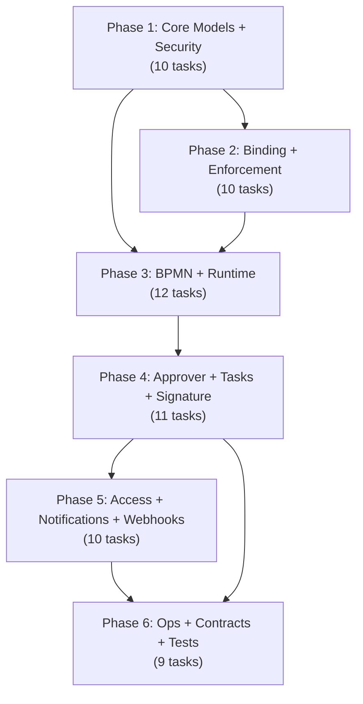

# Implementation Task Manifest (ITM) — Dynamic Approval Workflow

Version: `v1.0`
Date: `2026-03-01`
Owner: `Tech Lead`
Status: `draft`

---

## 1. Purpose

Dependency-ordered task list where each task is a self-contained unit for AI-assisted development. Each task produces 1–3 files with defined inputs and verification criteria. Tasks are grouped into 6 phases following dependency order. Each task maps 1:1 to a GitHub Issue.

## 2. Source References

| Document | Role |
|---|---|
| `docs/design/sds_dynamic_approval_workflow.md` | Architecture decisions (HOW) |
| `docs/design/omb/OMB-00..07` | Field-level specs (EXACTLY WHAT) |
| `docs/srs/supplementary/srs_to_development_bridge_plan.md` §5 | ITM format spec |
| `docs/design/rtm_dynamic_approval_workflow.md` | Awaiting TASK-* IDs |

## 3. Conventions

### 3.1 Task ID Scheme

`TASK-P{phase}-{sequence}` — e.g., `TASK-P1-001`

### 3.2 Complexity Legend

| Size | Estimated Effort | Files |
|---|---|---|
| `S` | 1–2 hours | 1–2 |
| `M` | 3–5 hours | 2–3 |
| `L` | 6–8 hours | 3 |

### 3.3 GitHub Mapping

| YAML Field | GitHub Field |
|---|---|
| `title` | Issue title |
| `phase` | Milestone (`Phase N: ...`) |
| `labels` | Issue labels |
| `depends_on` | "Blocked by #xx" in body |
| `acceptance_criteria` | Checkbox list in body |
| `files_to_create/modify` | Checkbox list in body |

### 3.4 Binding Constraints (SDS §19)

1. Three-module split is final.
2. Each task is module-scoped.
3. Max 3 files per task.
4. Each task independently verifiable.
5. Blocker tags on OI-15 (crypto) and OI-23 (TTL) affected tasks.

## 4. Phase Dependency Graph



---

## 5. Phase 1 — Core Models + Security

**Milestone:** `Phase 1: Core Models + Security`
**SRS Source:** SRS-01, SRS-07 (partial)
**Rationale:** Foundation — everything depends on definitions, versions, security groups.

---

```yaml
task_id: TASK-P1-001
title: "Create core module scaffold with manifest, security groups (approver/designer/admin/auditor), and group hierarchy"
status: pre_completed  # Scaffold already exists in repo
phase: 1
depends_on: []
agent: either
module: dynamic_approval_core
labels: ["phase:1", "module:core", "size:M", "type:security"]
files_to_create:
  - security/workflow_security.xml       # Still needed
files_to_modify:
  - __init__.py                          # Already exists
  - __manifest__.py                      # Already exists — update deps/data
blueprint_sections: ["OMB-00 §3-4", "OMB-03 §2"]
sds_sections: ["SDS §3", "SDS §15"]
srs_requirements: [FR-051, NFR-007]
acceptance_criteria:
  - Module installs without error via --stop-after-init
  - 4 security groups created (approver, designer, admin, auditor)
  - Group hierarchy correct (admin implies designer implies approver)
  - Module category 'Workflow' created
verification_command: |
  odoo-bin -d test_db -i dynamic_approval_core --stop-after-init
complexity: M
estimated_files: 3
blocker_tags: []
```

---

```yaml
task_id: TASK-P1-002
title: "Implement workflow.definition model with key/company constraints, CRUD overrides, and tag categorization model"
phase: 1
depends_on: [TASK-P1-001]
agent: either
module: dynamic_approval_core
labels: ["phase:1", "module:core", "size:M", "type:model"]
files_to_create:
  - models/__init__.py
  - models/workflow_definition.py
files_to_modify:
  - __init__.py
blueprint_sections: ["OMB-01 §1", "OMB-01 §30"]
sds_sections: ["SDS §4"]
srs_requirements: [FR-001, FR-002, FR-003, FR-004, FR-005, FR-006]
acceptance_criteria:
  - workflow.definition model with all fields from OMB-01 §1
  - workflow.definition.tag model with name, color, company_id
  - SQL constraints enforced (unique key per company, unique tag name per company)
  - Python constraints for key regex validation
  - CRUD overrides (unlink blocked when published versions exist)
verification_command: |
  python -m py_compile models/workflow_definition.py
  odoo-bin -d test_db -i dynamic_approval_core --stop-after-init
complexity: M
estimated_files: 3
blocker_tags: []
```

---

```yaml
task_id: TASK-P1-003
title: "Implement workflow.definition.version with draft/published/archived state machine, auto-increment versioning, and publish/archive/clone actions"
phase: 1
depends_on: [TASK-P1-002]
agent: either
module: dynamic_approval_core
labels: ["phase:1", "module:core", "size:M", "type:model"]
files_to_create:
  - models/workflow_definition_version.py
files_to_modify:
  - models/__init__.py
blueprint_sections: ["OMB-01 §2"]
sds_sections: ["SDS §4"]
srs_requirements: [FR-001, FR-003, FR-004, FR-005]
acceptance_criteria:
  - All fields from OMB-01 §2 with correct types and constraints
  - State machine (draft → published → archived)
  - Version auto-increment per (company_id, definition_id)
  - bpmn_xml immutable when state=published
  - action_publish, action_archive, action_clone methods
verification_command: |
  python -m py_compile models/workflow_definition_version.py
  odoo-bin -d test_db -i dynamic_approval_core --stop-after-init
complexity: M
estimated_files: 2
blocker_tags: []
```

---

```yaml
task_id: TASK-P1-004
title: "Implement workflow.definition.compiled with hash-based uniqueness and immutability enforcement"
phase: 1
depends_on: [TASK-P1-003]
agent: either
module: dynamic_approval_core
labels: ["phase:1", "module:core", "size:S", "type:model"]
files_to_create:
  - models/workflow_definition_compiled.py
files_to_modify:
  - models/__init__.py
blueprint_sections: ["OMB-01 §3"]
sds_sections: ["SDS §4"]
srs_requirements: [FR-005]
acceptance_criteria:
  - All fields from OMB-01 §3
  - SQL constraint unique_hash_company
  - Write/unlink overrides (immutable after creation)
verification_command: |
  python -m py_compile models/workflow_definition_compiled.py
  odoo-bin -d test_db -i dynamic_approval_core --stop-after-init
complexity: S
estimated_files: 2
blocker_tags: []
```

---

```yaml
task_id: TASK-P1-005
title: "Implement condition rules (expression validation, safe_eval) and follower rules (auto-subscribe logic) for definition versions"
phase: 1
depends_on: [TASK-P1-003]
agent: either
module: dynamic_approval_core
labels: ["phase:1", "module:core", "size:M", "type:model"]
files_to_create:
  - models/workflow_condition_rule.py
  - models/workflow_follower_rule.py
files_to_modify:
  - models/__init__.py
blueprint_sections: ["OMB-01 §17", "OMB-01 §16"]
sds_sections: ["SDS §4"]
srs_requirements: [FR-023, FR-024]
acceptance_criteria:
  - workflow.condition.rule with all fields from OMB-01 §17
  - workflow.follower.rule with all fields from OMB-01 §16
  - Python constraint for expression validation on condition rules
  - Both models cascade-delete with definition_version_id
verification_command: |
  odoo-bin -d test_db -i dynamic_approval_core --stop-after-init
complexity: M
estimated_files: 3
blocker_tags: []
```

---

```yaml
task_id: TASK-P1-006
title: "Implement attestation policy model defining required evidence types and capture methods per version [OI-15]"
phase: 1
depends_on: [TASK-P1-003]
agent: either
module: dynamic_approval_core
labels: ["phase:1", "module:core", "size:S", "type:model"]
files_to_create:
  - models/workflow_attestation_policy.py
files_to_modify:
  - models/__init__.py
blueprint_sections: ["OMB-01 §19"]
sds_sections: ["SDS §13"]
srs_requirements: [FR-043, FR-044]
acceptance_criteria:
  - All fields from OMB-01 §19
  - required_evidence_types and capture_methods as Char (comma-separated)
  - Cascades on definition_version_id delete
verification_command: |
  odoo-bin -d test_db -i dynamic_approval_core --stop-after-init
complexity: S
estimated_files: 2
blocker_tags: ["OI-15"]
```

---

```yaml
task_id: TASK-P1-007
title: "Implement immutable audit event logger (85 event types) and incident model with triage/resolve/close state machine"
phase: 1
depends_on: [TASK-P1-001]
agent: either
module: dynamic_approval_core
labels: ["phase:1", "module:core", "size:M", "type:model"]
files_to_create:
  - models/workflow_audit_event.py
  - models/workflow_incident.py
files_to_modify:
  - models/__init__.py
blueprint_sections: ["OMB-01 §27", "OMB-01 §28"]
sds_sections: ["SDS §8"]
srs_requirements: [FR-068, FR-095, NFR-010]
acceptance_criteria:
  - workflow.audit.event with all 85 event_type values
  - Immutable (write/unlink blocked)
  - workflow.incident with state machine (open → triaged → resolved → closed)
  - Incident business methods (action_triage, action_resolve, action_close, action_retry)
verification_command: |
  odoo-bin -d test_db -i dynamic_approval_core --stop-after-init
complexity: M
estimated_files: 3
blocker_tags: []
```

---

```yaml
task_id: TASK-P1-008
title: "Create ir.model.access.csv ACLs and multi-company record rules for all 9 Phase 1 models"
phase: 1
depends_on: [TASK-P1-002, TASK-P1-003, TASK-P1-004, TASK-P1-005, TASK-P1-006, TASK-P1-007]
agent: either
module: dynamic_approval_core
labels: ["phase:1", "module:core", "size:M", "type:security"]
files_to_create:
  - security/ir.model.access.csv
files_to_modify:
  - security/workflow_security.xml
blueprint_sections: ["OMB-03 §3", "OMB-03 §4"]
sds_sections: ["SDS §9", "SDS §15"]
srs_requirements: [FR-051, FR-079, NFR-007]
acceptance_criteria:
  - ACL rows for all Phase 1 models (definition, tag, version, compiled, condition_rule, follower_rule, attestation_policy, audit_event, incident)
  - Naming convention access_{model_short}_{group_short}
  - Multi-company record rules for all models
  - Auditor has read-only across all models
verification_command: |
  odoo-bin -d test_db -i dynamic_approval_core --stop-after-init
complexity: M
estimated_files: 2
blocker_tags: []
```

---

```yaml
task_id: TASK-P1-009
title: "Create definition form/list/search views, version inline notebook, root Approvals menu, and action windows"
phase: 1
depends_on: [TASK-P1-008]
agent: either
module: dynamic_approval_core
labels: ["phase:1", "module:core", "size:M", "type:view"]
files_to_create:
  - views/workflow_definition_views.xml
  - views/menu_views.xml
files_to_modify:
  - __manifest__.py
blueprint_sections: ["OMB-02 §1", "OMB-02 §2"]
sds_sections: ["SDS §16"]
srs_requirements: [FR-001, FR-002]
acceptance_criteria:
  - Root menu 'Approvals' with correct groups
  - Definition list, form, and search views per OMB-02 §2
  - Version inline in definition form (One2many notebook page)
  - Action windows with correct domains
verification_command: |
  odoo-bin -d test_db -i dynamic_approval_core --stop-after-init
complexity: M
estimated_files: 3
blocker_tags: []
```

---

```yaml
task_id: TASK-P1-010
title: "Write unit tests for definition CRUD lifecycle, version auto-increment, key constraints, publish immutability, and multi-company isolation"
phase: 1
depends_on: [TASK-P1-009]
agent: either
module: dynamic_approval_core
labels: ["phase:1", "module:core", "size:M", "type:test"]
files_to_create:
  - tests/__init__.py
  - tests/test_workflow_definition.py
files_to_modify: []
blueprint_sections: ["OMB-01 §1-3"]
sds_sections: ["SDS §3.6"]
srs_requirements: [FR-001, FR-003, FR-004, FR-005]
acceptance_criteria:
  - Test definition CRUD lifecycle (create, publish, archive)
  - Test version auto-increment
  - Test key regex constraint
  - Test immutability after publish
  - Test multi-company isolation
  - Test security group permissions (designer can create, approver cannot)
verification_command: |
  odoo-bin -d test_db --test-tags /dynamic_approval_core
complexity: M
estimated_files: 2
blocker_tags: []
```

---

## 6. Phase 2 — Binding + Enforcement + Callback

**Milestone:** `Phase 2: Binding + Enforcement`
**SRS Source:** SRS-02
**Rationale:** Needs definitions from Phase 1; enables gating and action interception.

---

```yaml
task_id: TASK-P2-001
title: "Implement workflow binding model (target_model, enforcement_mode, callback) and scope model with unique-per-version constraint"
phase: 2
depends_on: [TASK-P1-003]
agent: either
module: dynamic_approval_core
labels: ["phase:2", "module:core", "size:L", "type:model"]
files_to_create:
  - models/workflow_binding.py
  - models/workflow_binding_scope.py
files_to_modify: [models/__init__.py]
blueprint_sections: ["OMB-01 §5", "OMB-01 §6"]
sds_sections: ["SDS §7"]
srs_requirements: [FR-007, FR-008, FR-009, FR-010, FR-011, FR-090]
acceptance_criteria:
  - workflow.binding with all fields from OMB-01 §5
  - workflow.binding.scope with all fields from OMB-01 §6
  - SQL constraint unique_binding_per_version
  - Python constraints for callback method regex, HTTPS URL validation
verification_command: |
  odoo-bin -d test_db -i dynamic_approval_core --stop-after-init
complexity: L
estimated_files: 3
blocker_tags: []
```

---

```yaml
task_id: TASK-P2-002
title: "Implement ORM enforcement interceptor with _patch_method wrapping, fail-closed behavior, and all-channel coverage (UI/RPC/import/cron/sudo)"
phase: 2
depends_on: [TASK-P2-001]
agent: either
module: dynamic_approval_core
labels: ["phase:2", "module:core", "size:L", "type:model"]
files_to_create: [models/workflow_enforcement_interceptor.py]
files_to_modify: [models/__init__.py]
blueprint_sections: ["OMB-01 §29"]
sds_sections: ["SDS §7"]
srs_requirements: [FR-008, FR-009, FR-010, FR-011, FR-012, FR-081, NFR-017]
acceptance_criteria:
  - Abstract model with _register = False
  - _patch_method wrapping for orm_enforced/hybrid bindings
  - Fail-closed behavior on errors
  - All channels covered (UI, RPC, import, cron, sudo)
  - Bypass via _workflow_bypass_token context key
verification_command: |
  odoo-bin -d test_db -i dynamic_approval_core --stop-after-init
complexity: L
estimated_files: 2
blocker_tags: []
```

---

```yaml
task_id: TASK-P2-003
title: "Verify and update exception hierarchy (WorkflowError, GateBlocked, Configuration, Runtime, LockTimeout, Callback, Idempotency, Integrity, SecurityPolicy)"
status: pre_completed  # exceptions.py already exists in repo
phase: 2
depends_on: [TASK-P1-001]
agent: either
module: dynamic_approval_core
labels: ["phase:2", "module:core", "size:S", "type:model"]
files_to_create: []
files_to_modify: [exceptions.py]  # Verify/update to match OMB-01 §29
blueprint_sections: ["OMB-01 §29"]
sds_sections: ["SDS §8.2"]
srs_requirements: [FR-095, NFR-010]
acceptance_criteria:
  - WorkflowError (UserError), WorkflowGateBlockedError, WorkflowConfigurationError
  - WorkflowRuntimeError, WorkflowLockTimeoutError, WorkflowCallbackError
  - WorkflowIdempotencyConflictError, WorkflowIntegrityError, WorkflowSecurityPolicyError
verification_command: |
  python -m py_compile exceptions.py
complexity: S
estimated_files: 2
blocker_tags: []
```

---

```yaml
task_id: TASK-P2-004
title: "Implement approval mixin providing approval_state, active_instance lookups, and gate-check methods for target models"
phase: 2
depends_on: [TASK-P2-001]
agent: either
module: dynamic_approval_core
labels: ["phase:2", "module:core", "size:S", "type:model"]
files_to_create: [models/workflow_approval_mixin.py]
files_to_modify: [models/__init__.py]
blueprint_sections: ["OMB-01 §29"]
sds_sections: ["SDS §4"]
srs_requirements: [FR-007]
acceptance_criteria:
  - Abstract mixin with approval_state, active_instance_id, active_instance_state
  - Methods _get_active_workflow_instance, _check_approval_gate
verification_command: |
  python -m py_compile models/workflow_approval_mixin.py
complexity: S
estimated_files: 2
blocker_tags: []
```

---

```yaml
task_id: TASK-P2-005
title: "Create binding form/list/search views with scope inline, callback notebook page, and designer-group menu item"
phase: 2
depends_on: [TASK-P2-001, TASK-P1-008]
agent: either
module: dynamic_approval_core
labels: ["phase:2", "module:core", "size:M", "type:view"]
files_to_create: [views/workflow_binding_views.xml]
files_to_modify: [views/menu_views.xml, __manifest__.py]
blueprint_sections: ["OMB-02 §3"]
sds_sections: ["SDS §16"]
srs_requirements: [FR-007, FR-008]
acceptance_criteria:
  - Binding list, form, and search views per OMB-02 §3
  - Scope inline One2many in binding form
  - Callback configuration in conditional notebook page
verification_command: |
  odoo-bin -d test_db -i dynamic_approval_core --stop-after-init
complexity: M
estimated_files: 3
blocker_tags: []
```

---

```yaml
task_id: TASK-P2-006
title: "Add ACL rows for binding and binding_scope models following naming convention"
phase: 2
depends_on: [TASK-P2-001, TASK-P2-002, TASK-P2-004]
agent: either
module: dynamic_approval_core
labels: ["phase:2", "module:core", "size:S", "type:security"]
files_to_create: []
files_to_modify: [security/ir.model.access.csv]
blueprint_sections: ["OMB-03 §3"]
sds_sections: ["SDS §15"]
srs_requirements: [FR-051, NFR-007]
acceptance_criteria:
  - ACL rows for binding, binding_scope models
  - Naming follows access_{model_short}_{group_short}
verification_command: |
  odoo-bin -d test_db -i dynamic_approval_core --stop-after-init
complexity: S
estimated_files: 1
blocker_tags: []
```

---

```yaml
task_id: TASK-P2-007
title: "Create system parameters (lock timeout, retries, SLA defaults) and 8 mail templates (task_assigned through sla_breached)"
phase: 2
depends_on: [TASK-P1-001]
agent: either
module: dynamic_approval_core
labels: ["phase:2", "module:core", "size:M", "type:data"]
files_to_create: [data/workflow_data.xml, data/mail_template_data.xml]
files_to_modify: [__manifest__.py]
blueprint_sections: ["OMB-04 §2", "OMB-04 §3"]
sds_sections: ["SDS §6.3"]
srs_requirements: [FR-036, FR-037]
acceptance_criteria:
  - System parameters for lock timeout, retry settings, SLA defaults
  - 8 mail templates (task_assigned..sla_breached)
verification_command: |
  odoo-bin -d test_db -i dynamic_approval_core --stop-after-init
complexity: M
estimated_files: 3
blocker_tags: []
```

---

```yaml
task_id: TASK-P2-008
title: "Create 6 cron jobs: timer discovery (1m), SLA checker (5m), deadline checker (5m), grant expiry (5m), reconciliation (1h), idempotency purge (1d)"
phase: 2
depends_on: [TASK-P1-007, TASK-P2-001]
agent: either
module: dynamic_approval_core
labels: ["phase:2", "module:core", "size:S", "type:data"]
files_to_create: [data/ir_cron_data.xml]
files_to_modify: [__manifest__.py]
blueprint_sections: ["OMB-04 §1"]
sds_sections: ["SDS §6.3"]
srs_requirements: [FR-073, NFR-002]
acceptance_criteria:
  - 6 cron jobs (timer discovery 1m, SLA 5m, deadline 5m, grant expiry 5m, grant reconciliation 1h, idempotency purge 1d)
verification_command: |
  odoo-bin -d test_db -i dynamic_approval_core --stop-after-init
complexity: S
estimated_files: 2
blocker_tags: []
```

---

```yaml
task_id: TASK-P2-009
title: "Create incident list/form/search views with statusbar, action buttons (Triage/Resolve/Close/Retry), and admin menu item"
phase: 2
depends_on: [TASK-P1-007, TASK-P1-008]
agent: either
module: dynamic_approval_core
labels: ["phase:2", "module:core", "size:S", "type:view"]
files_to_create: [views/workflow_incident_views.xml]
files_to_modify: [views/menu_views.xml]
blueprint_sections: ["OMB-02 §7"]
sds_sections: ["SDS §8"]
srs_requirements: [FR-068]
acceptance_criteria:
  - Incident list, form, search views with statusbar widget
  - Action buttons (Triage, Resolve, Close, Retry)
verification_command: |
  odoo-bin -d test_db -i dynamic_approval_core --stop-after-init
complexity: S
estimated_files: 2
blocker_tags: []
```

---

```yaml
task_id: TASK-P2-010
title: "Write unit tests for binding CRUD, enforcement gate decisions (blocked/allowed/warned), all-channel interception, and fail-closed error handling"
phase: 2
depends_on: [TASK-P2-005, TASK-P2-006]
agent: either
module: dynamic_approval_core
labels: ["phase:2", "module:core", "size:L", "type:test"]
files_to_create: [tests/test_workflow_binding.py, tests/test_workflow_enforcement.py]
files_to_modify: [tests/__init__.py]
blueprint_sections: ["OMB-01 §5-6", "OMB-01 §29"]
sds_sections: ["SDS §7"]
srs_requirements: [FR-007, FR-008, FR-009, FR-010, FR-011, NFR-017]
acceptance_criteria:
  - Test binding CRUD and validation
  - Test enforcement gate (blocked, allowed, allowed_with_warning)
  - Test all channels (method call, sudo, context bypass)
  - Test fail-closed behavior
verification_command: |
  odoo-bin -d test_db --test-tags /dynamic_approval_core
complexity: L
estimated_files: 3
blocker_tags: []
```


---

## 7. Phase 3 — BPMN + Runtime Engine

**Milestone:** `Phase 3: BPMN + Runtime`
**SRS Source:** SRS-03, SRS-04
**Rationale:** Needs definitions + bindings; enables workflow execution and diagram rendering.

---

```yaml
task_id: TASK-P3-001
title: "Implement workflow.instance with 15-state transition machine, _tick engine loop, advisory locking, and cancel/recover actions"
phase: 3
depends_on: [TASK-P1-003, TASK-P2-001]
agent: either
module: dynamic_approval_core
labels: ["phase:3", "module:core", "size:L", "type:model"]
files_to_create: [models/workflow_instance.py]
files_to_modify: [models/__init__.py]
blueprint_sections: ["OMB-01 §8"]
sds_sections: ["SDS §6"]
srs_requirements: [FR-021, FR-022, FR-026, FR-027, FR-028]
acceptance_criteria:
  - All fields from OMB-01 §8 including One2many inverse fields
  - State machine with 15 transitions per transition table
  - Advisory lock (pg_advisory_xact_lock) on _tick method
  - _tick method implementing token-based engine loop (evaluate conditions, fire transitions, advance tokens)
  - action_cancel, action_recover, action_suspend, action_resume methods
  - _evaluate_gate_condition dispatching to condition.rule evaluator
  - Recompute state from child node_runtime states
verification_command: |
  odoo-bin -d test_db -i dynamic_approval_core --stop-after-init
complexity: L
estimated_files: 2
blocker_tags: []
```

---

```yaml
task_id: TASK-P3-002
title: "Implement node runtime with pending/active/completed/error state machine and timer expiry cron method"
phase: 3
depends_on: [TASK-P3-001]
agent: either
module: dynamic_approval_core
labels: ["phase:3", "module:core", "size:M", "type:model"]
files_to_create: [models/workflow_node_runtime.py]
files_to_modify: [models/__init__.py]
blueprint_sections: ["OMB-01 §9"]
sds_sections: ["SDS §6"]
srs_requirements: [FR-021, FR-022, FR-023]
acceptance_criteria:
  - All fields from OMB-01 §9
  - Node state machine (pending → active → completed/error)
  - _cron_discover_expired_timers method
verification_command: |
  odoo-bin -d test_db -i dynamic_approval_core --stop-after-init
complexity: M
estimated_files: 2
blocker_tags: []
```

---

```yaml
task_id: TASK-P3-003
title: "Implement token model with _advance, _consume, _fork (parallel split), _join (quorum merge), and never-delete policy"
phase: 3
depends_on: [TASK-P3-001, TASK-P3-002]
agent: either
module: dynamic_approval_core
labels: ["phase:3", "module:core", "size:M", "type:model"]
files_to_create: [models/workflow_token.py]
files_to_modify: [models/__init__.py]
blueprint_sections: ["OMB-01 §10"]
sds_sections: ["SDS §6.6"]
srs_requirements: [FR-021, FR-022, FR-025]
acceptance_criteria:
  - All fields from OMB-01 §10 (state, parent_token_id, branch_type, node_runtime_id)
  - Token never deleted — state transitions only (active → consumed/cancelled)
  - _advance method moving token to next node via transition lookup
  - _consume method marking token consumed and creating child tokens at split
  - _fork method creating N child tokens for parallel gateway
  - _join method with quorum check before merging parallel branches
verification_command: |
  odoo-bin -d test_db -i dynamic_approval_core --stop-after-init
complexity: M
estimated_files: 2
blocker_tags: []
```

---

```yaml
task_id: TASK-P3-004
title: "Implement immutable decision event model with correlation/causation IDs for audit trail"
phase: 3
depends_on: [TASK-P3-001]
agent: either
module: dynamic_approval_core
labels: ["phase:3", "module:core", "size:S", "type:model"]
files_to_create: [models/workflow_decision_event.py]
files_to_modify: [models/__init__.py]
blueprint_sections: ["OMB-01 §11"]
sds_sections: ["SDS §6"]
srs_requirements: [FR-029, FR-030]
acceptance_criteria:
  - All fields from OMB-01 §11
  - Immutable after creation
verification_command: |
  odoo-bin -d test_db -i dynamic_approval_core --stop-after-init
complexity: S
estimated_files: 2
blocker_tags: []
```

---

```yaml
task_id: TASK-P3-005
title: "Create instance form/list/search views with statusbar, token/node/decision notebook tabs, and Approvals menu item"
phase: 3
depends_on: [TASK-P3-001, TASK-P3-002, TASK-P3-003, TASK-P3-004]
agent: either
module: dynamic_approval_core
labels: ["phase:3", "module:core", "size:M", "type:view"]
files_to_create: [views/workflow_instance_views.xml]
files_to_modify: [views/menu_views.xml, __manifest__.py]
blueprint_sections: ["OMB-02 §5"]
sds_sections: ["SDS §16"]
srs_requirements: [FR-021, FR-022]
acceptance_criteria:
  - Instance list, form, and search views per OMB-02 §5
  - Statusbar for instance state
  - Notebook with tokens, node runtimes, decision events
verification_command: |
  odoo-bin -d test_db -i dynamic_approval_core --stop-after-init
complexity: M
estimated_files: 3
blocker_tags: []
```

---

```yaml
task_id: TASK-P3-006
title: "Add ACL rows and multi-company record rules for instance, node_runtime, token, and decision_event models"
phase: 3
depends_on: [TASK-P3-001, TASK-P3-002, TASK-P3-003, TASK-P3-004]
agent: either
module: dynamic_approval_core
labels: ["phase:3", "module:core", "size:S", "type:security"]
files_to_create: []
files_to_modify: [security/ir.model.access.csv]
blueprint_sections: ["OMB-03 §3"]
sds_sections: ["SDS §15"]
srs_requirements: [FR-051, NFR-007]
acceptance_criteria:
  - ACL rows for instance, node_runtime, token, decision_event
  - Multi-company record rules for runtime models
verification_command: |
  odoo-bin -d test_db -i dynamic_approval_core --stop-after-init
complexity: S
estimated_files: 1
blocker_tags: []
```

---

```yaml
task_id: TASK-P3-007
title: "Implement BPMN diagram_asset (bpmn_xml, thumbnail) and validation_result models with bpmn.js >=17.0.0 dependency"
phase: 3
status: pre_completed  # Scaffold exists
depends_on: [TASK-P1-003]
agent: either
module: dynamic_approval_bpmn
labels: ["phase:3", "module:bpmn", "size:M", "type:model"]
files_to_create: [models/workflow_diagram_asset.py, models/workflow_diagram_validation_result.py]
files_to_modify: [__init__.py, __manifest__.py, models/__init__.py]  # scaffold pre-exists
blueprint_sections: ["OMB-05 §1", "OMB-05 §2"]
sds_sections: ["SDS §5"]
srs_requirements: [FR-013, FR-014, FR-015]
acceptance_criteria:
  - workflow.diagram.asset with bpmn_xml, thumbnail fields
  - workflow.diagram.validation.result with structured error fields
  - bpmn.js >= 17.0.0 declared
verification_command: |
  odoo-bin -d test_db -i dynamic_approval_bpmn --stop-after-init
complexity: M
estimated_files: 3
blocker_tags: []
```

---

```yaml
task_id: TASK-P3-008
title: "Build OWL 2 BpmnModeler component with lazy bpmn-js loading, diagram-changed/element-selected events, and validation RPC calls"
phase: 3
depends_on: [TASK-P3-007]
agent: either
module: dynamic_approval_bpmn
labels: ["phase:3", "module:bpmn", "size:L", "type:js"]
files_to_create:
  - static/src/components/bpmn_modeler/bpmn_modeler.js
  - static/src/components/bpmn_modeler/bpmn_modeler.xml
  - static/src/components/bpmn_modeler/bpmn_modeler.scss
blueprint_sections: ["OMB-05 §3"]
sds_sections: ["SDS §5"]
srs_requirements: [FR-013, FR-014, NFR-009]
acceptance_criteria:
  - OWL 2 component with lazy bpmn-js loading
  - Events emitted (diagram-changed, element-selected, validation-triggered, save-requested)
  - RPC calls (validate_bpmn_xml, compile_version)
  - Keyboard shortcuts
verification_command: |
  eslint static/src/components/bpmn_modeler/
complexity: L
estimated_files: 3
blocker_tags: []
```

---

```yaml
task_id: TASK-P3-009
title: "Build OWL 2 BpmnViewer component with read-only rendering, runtime state overlays, color-coded nodes, and 5s polling"
phase: 3
depends_on: [TASK-P3-007]
agent: either
module: dynamic_approval_bpmn
labels: ["phase:3", "module:bpmn", "size:M", "type:js"]
files_to_create:
  - static/src/components/bpmn_viewer/bpmn_viewer.js
  - static/src/components/bpmn_viewer/bpmn_viewer.xml
  - static/src/components/bpmn_viewer/bpmn_viewer.scss
blueprint_sections: ["OMB-05 §4"]
sds_sections: ["SDS §5.4"]
srs_requirements: [FR-016, FR-020, NFR-009]
acceptance_criteria:
  - Read-only viewer with runtime overlay support
  - State → CSS class mapping, 5s polling
verification_command: |
  eslint static/src/components/bpmn_viewer/
complexity: M
estimated_files: 3
blocker_tags: []
```

---

```yaml
task_id: TASK-P3-010
title: "Register bpmn_xml custom field widget and create diagram asset list/form views with BPMN menu entry"
phase: 3
depends_on: [TASK-P3-008, TASK-P3-009]
agent: either
module: dynamic_approval_bpmn
labels: ["phase:3", "module:bpmn", "size:M", "type:js"]
files_to_create: [static/src/fields/bpmn_field.js, views/workflow_diagram_views.xml]
files_to_modify: [__manifest__.py]
blueprint_sections: ["OMB-05 §3-4", "OMB-02 cross-ref"]
sds_sections: ["SDS §5"]
srs_requirements: [FR-013, FR-016]
acceptance_criteria:
  - Custom field widget 'bpmn_xml'
  - Diagram views and menu
verification_command: |
  odoo-bin -d test_db -i dynamic_approval_bpmn --stop-after-init
complexity: M
estimated_files: 3
blocker_tags: []
```

---

```yaml
task_id: TASK-P3-011
title: "Create BPMN module ACLs for diagram_asset and validation_result (designer/admin full, auditor read-only)"
phase: 3
depends_on: [TASK-P3-007]
agent: either
module: dynamic_approval_bpmn
labels: ["phase:3", "module:bpmn", "size:S", "type:security"]
files_to_create: [security/ir.model.access.csv]
blueprint_sections: ["OMB-03 §3"]
sds_sections: ["SDS §15"]
srs_requirements: [FR-051]
acceptance_criteria:
  - ACLs for diagram_asset, diagram_validation_result
verification_command: |
  odoo-bin -d test_db -i dynamic_approval_bpmn --stop-after-init
complexity: S
estimated_files: 1
blocker_tags: []
```

---

```yaml
task_id: TASK-P3-012
title: "Write unit tests for instance state transitions, token advancement (sequential + parallel), advisory lock contention, and incident creation"
phase: 3
depends_on: [TASK-P3-006]
agent: either
module: dynamic_approval_core
labels: ["phase:3", "module:core", "size:L", "type:test"]
files_to_create: [tests/test_workflow_runtime.py]
files_to_modify: [tests/__init__.py]
blueprint_sections: ["OMB-01 §8-10"]
sds_sections: ["SDS §6"]
srs_requirements: [FR-021, FR-022, FR-025, FR-026, NFR-002, NFR-004]
acceptance_criteria:
  - Test instance creation and state transitions
  - Test token advancement (sequential, parallel)
  - Test advisory lock and concurrency
verification_command: |
  odoo-bin -d test_db --test-tags /dynamic_approval_core
complexity: L
estimated_files: 2
blocker_tags: []
```

---

## 8. Phase 4 — Approver Resolution + Tasks + Signature

**Milestone:** `Phase 4: Approver + Tasks + Signature`
**SRS Source:** SRS-05, SRS-06
**Rationale:** Needs runtime engine from Phase 3; enables human approval flow.

---

```yaml
task_id: TASK-P4-001
title: "Implement workflow.task with pending/assigned/in_progress/completed state machine, approve/reject/reassign/delegate actions, and immutable transition log"
phase: 4
depends_on: [TASK-P3-002]
agent: either
module: dynamic_approval_core
labels: ["phase:4", "module:core", "size:L", "type:model"]
files_to_create: [models/workflow_task.py, models/workflow_task_transition.py]
files_to_modify: [models/__init__.py]
blueprint_sections: ["OMB-01 §12", "OMB-01 §13"]
sds_sections: ["SDS §6"]
srs_requirements: [FR-029, FR-030, FR-031, FR-032, FR-033, FR-034, FR-035]
acceptance_criteria:
  - workflow.task with all fields, state machine (pending → assigned → in_progress → completed/cancelled)
  - workflow.task.transition with immutable audit trail
  - One2many transition_ids on task
  - _cron_check_sla and _cron_check_deadlines methods
  - action_approve, action_reject, action_reassign, action_delegate
verification_command: |
  odoo-bin -d test_db -i dynamic_approval_core --stop-after-init
complexity: L
estimated_files: 3
blocker_tags: []
```

---

```yaml
task_id: TASK-P4-002
title: "Implement approver resolution with 3 strategies (fixed_users, group_members, domain_expression), priority ordering, and no-approver fallback"
phase: 4
depends_on: [TASK-P1-003]
agent: either
module: dynamic_approval_core
labels: ["phase:4", "module:core", "size:M", "type:model"]
files_to_create: [models/workflow_approver_resolution.py]
files_to_modify: [models/__init__.py]
blueprint_sections: ["OMB-01 §15"]
sds_sections: ["SDS §4"]
srs_requirements: [FR-029, FR-030, FR-031]
acceptance_criteria:
  - All fields from OMB-01 §15 (resolution_type, group_id, user_ids, domain_expression)
  - _resolve_approvers method returning applicable user recordset
  - Resolution strategies: fixed_users (return user_ids), group_members (group_id.users), domain_expression (safe_eval)
  - Priority ordering when multiple resolutions match
  - Fallback logic when no approvers found (create incident)
verification_command: |
  odoo-bin -d test_db -i dynamic_approval_core --stop-after-init
complexity: M
estimated_files: 2
blocker_tags: []
```

---

```yaml
task_id: TASK-P4-003
title: "Implement delegation record with delegator/delegate, date range scoping, _is_delegation_active check, and company-scoped audit"
phase: 4
depends_on: [TASK-P4-001]
agent: either
module: dynamic_approval_core
labels: ["phase:4", "module:core", "size:M", "type:model"]
files_to_create: [models/workflow_delegation_record.py]
files_to_modify: [models/__init__.py]
blueprint_sections: ["OMB-01 §14"]
sds_sections: ["SDS §4"]
srs_requirements: [FR-033, FR-034]
acceptance_criteria:
  - All fields from OMB-01 §14 (delegator_id, delegate_id, scope, date range)
  - _is_delegation_active method
  - Company-scoped with delegation audit
verification_command: |
  odoo-bin -d test_db -i dynamic_approval_core --stop-after-init
complexity: M
estimated_files: 2
blocker_tags: []
```

---

```yaml
task_id: TASK-P4-004
title: "Implement signature evidence with SHA-256 hashing, immutability enforcement, supersede mechanism, and attestation policy link [OI-15]"
phase: 4
depends_on: [TASK-P4-001, TASK-P1-006]
agent: either
module: dynamic_approval_core
labels: ["phase:4", "module:core", "size:M", "type:model"]
files_to_create: [models/workflow_signature_evidence.py]
files_to_modify: [models/__init__.py]
blueprint_sections: ["OMB-01 §18"]
sds_sections: ["SDS §13"]
srs_requirements: [FR-043, FR-044, FR-045, FR-046, FR-084, FR-085, FR-096]
acceptance_criteria:
  - All fields from OMB-01 §18 (evidence_type, hash, attachment_id, policy_id)
  - Immutable (write/unlink blocked)
  - Supersede mechanism with superseded_by_id
  - SHA-256 hash computation
verification_command: |
  odoo-bin -d test_db -i dynamic_approval_core --stop-after-init
complexity: M
estimated_files: 2
blocker_tags: ["OI-15"]
```

---

```yaml
task_id: TASK-P4-005
title: "Create task form/list/kanban/search views with color-coded kanban cards, approve/reject/reassign/delegate buttons, and My Tasks menu"
phase: 4
depends_on: [TASK-P4-001, TASK-P3-006]
agent: either
module: dynamic_approval_core
labels: ["phase:4", "module:core", "size:M", "type:view"]
files_to_create: [views/workflow_task_views.xml]
files_to_modify: [views/menu_views.xml, __manifest__.py]
blueprint_sections: ["OMB-02 §6"]
sds_sections: ["SDS §16"]
srs_requirements: [FR-029, FR-030]
acceptance_criteria:
  - Task list, form, kanban, and search views per OMB-02 §6
  - Kanban grouped by status with color coding
  - Action buttons (Approve, Reject, Reassign, Delegate)
  - Statusbar widget
verification_command: |
  odoo-bin -d test_db -i dynamic_approval_core --stop-after-init
complexity: M
estimated_files: 3
blocker_tags: []
```

---

```yaml
task_id: TASK-P4-006
title: "Add ACL rows for task, task_transition, approver_resolution, delegation_record, and signature_evidence models"
phase: 4
depends_on: [TASK-P4-001, TASK-P4-002, TASK-P4-003, TASK-P4-004]
agent: either
module: dynamic_approval_core
labels: ["phase:4", "module:core", "size:S", "type:security"]
files_to_create: []
files_to_modify: [security/ir.model.access.csv]
blueprint_sections: ["OMB-03 §3"]
sds_sections: ["SDS §15"]
srs_requirements: [FR-051, NFR-007]
acceptance_criteria:
  - ACL rows for task, task_transition, approver_resolution, delegation_record, signature_evidence
verification_command: |
  odoo-bin -d test_db -i dynamic_approval_core --stop-after-init
complexity: S
estimated_files: 1
blocker_tags: []
```

---

```yaml
task_id: TASK-P4-007
title: "Write unit tests for task assignment, approve/reject flows, delegation date-range logic, approver resolution strategies, and SLA/deadline cron"
phase: 4
depends_on: [TASK-P4-005, TASK-P4-006]
agent: either
module: dynamic_approval_core
labels: ["phase:4", "module:core", "size:L", "type:test"]
files_to_create: [tests/test_workflow_task.py]
files_to_modify: [tests/__init__.py]
blueprint_sections: ["OMB-01 §12-15"]
sds_sections: ["SDS §6"]
srs_requirements: [FR-029, FR-030, FR-031, FR-033, FR-034]
acceptance_criteria:
  - Test task assignment and resolution
  - Test approve/reject/reassign/delegate flows
  - Test delegation date range logic
  - Test approver resolution (group, user, domain)
  - Test SLA and deadline cron logic
verification_command: |
  odoo-bin -d test_db --test-tags /dynamic_approval_core
complexity: L
estimated_files: 2
blocker_tags: []
```

---

## 9. Phase 5 — Access Grants + Notifications + Webhooks

**Milestone:** `Phase 5: Access + Notifications + Webhooks`
**SRS Source:** SRS-07 (remainder), SRS-08
**Rationale:** Needs tasks from Phase 4; enables temporary access, email/webhook dispatch.

---

```yaml
task_id: TASK-P5-001
title: "Implement access grant lifecycle (active/expired/revoked), TTL enforcement (5min-72h), expiry/reconcile crons, and immutable grant log"
phase: 5
depends_on: [TASK-P4-001]
agent: either
module: dynamic_approval_core
labels: ["phase:5", "module:core", "size:M", "type:model"]
files_to_create: [models/workflow_access_grant.py, models/workflow_access_grant_log.py]
files_to_modify: [models/__init__.py]
blueprint_sections: ["OMB-01 §20", "OMB-01 §21"]
sds_sections: ["SDS §11"]
srs_requirements: [FR-051, FR-052, FR-053, FR-054, FR-055]
acceptance_criteria:
  - Grant lifecycle (active → expired/revoked)
  - TTL enforcement (5min–72h, default 24h)
  - _cron_expire_grants and _cron_reconcile_orphan_grants methods
  - Immutable audit log entries
verification_command: |
  odoo-bin -d test_db -i dynamic_approval_core --stop-after-init
complexity: M
estimated_files: 3
blocker_tags: []
```

---

```yaml
task_id: TASK-P5-002
title: "Implement notification template (event triggers, channels) and delivery log with queue_job async dispatch and delivery tracking"
phase: 5
depends_on: [TASK-P4-001]
agent: either
module: dynamic_approval_core
labels: ["phase:5", "module:core", "size:M", "type:model"]
files_to_create: [models/workflow_notification_template.py, models/workflow_notification_log.py]
files_to_modify: [models/__init__.py]
blueprint_sections: ["OMB-01 §22", "OMB-01 §23"]
sds_sections: ["SDS §12"]
srs_requirements: [FR-036, FR-037, FR-038, FR-039]
acceptance_criteria:
  - Template with event_trigger, channel, mail_template_id
  - Log with delivery tracking (sent, delivered, failed, bounced)
  - queue_job dispatch for async delivery
verification_command: |
  odoo-bin -d test_db -i dynamic_approval_core --stop-after-init
complexity: M
estimated_files: 3
blocker_tags: []
```

---

```yaml
task_id: TASK-P5-003
title: "Implement webhook endpoint (HMAC-SHA256 secret) and outbound event with queued/sending/delivered/failed/dead_letter state machine and retry backoff"
phase: 5
depends_on: [TASK-P3-001]
agent: either
module: dynamic_approval_core
labels: ["phase:5", "module:core", "size:L", "type:model"]
files_to_create: [models/workflow_webhook_endpoint.py, models/workflow_outbound_event.py]
files_to_modify: [models/__init__.py]
blueprint_sections: ["OMB-01 §24", "OMB-01 §25"]
sds_sections: ["SDS §12"]
srs_requirements: [FR-056, FR-057, FR-058, FR-059, FR-060, FR-083, NFR-005]
acceptance_criteria:
  - Webhook endpoint with HMAC-SHA256 secret
  - Outbound event with state machine (queued → sending → delivered/failed/dead_letter)
  - Retry policy (5 attempts, backoff)
  - RFC-8785 canonical JSON for signature
verification_command: |
  odoo-bin -d test_db -i dynamic_approval_core --stop-after-init
complexity: L
estimated_files: 3
blocker_tags: []
```

---

```yaml
task_id: TASK-P5-004
title: "Implement idempotency registry with UNIQUE operation_scope_hash, replay vs conflict detection, and 90-day TTL purge cron [OI-23]"
phase: 5
depends_on: [TASK-P1-001]
agent: either
module: dynamic_approval_core
labels: ["phase:5", "module:core", "size:M", "type:model"]
files_to_create: [models/workflow_idempotency_registry.py]
files_to_modify: [models/__init__.py]
blueprint_sections: ["OMB-01 §26"]
sds_sections: ["SDS §10"]
srs_requirements: [NFR-016]
acceptance_criteria:
  - All fields from OMB-01 §26
  - UNIQUE constraint on operation_scope_hash
  - Replay vs conflict detection (payload_hash comparison)
  - _cron_purge_expired method
  - Interim TTL 90 days (configurable)
verification_command: |
  odoo-bin -d test_db -i dynamic_approval_core --stop-after-init
complexity: M
estimated_files: 2
blocker_tags: ["OI-23"]
```

---

```yaml
task_id: TASK-P5-005
title: "Create webhook endpoint list/form views and outbound event log views with Integrations menu section"
phase: 5
depends_on: [TASK-P5-003]
agent: either
module: dynamic_approval_core
labels: ["phase:5", "module:core", "size:S", "type:view"]
files_to_create: [views/workflow_webhook_views.xml]
files_to_modify: [views/menu_views.xml]
blueprint_sections: ["OMB-02 §8"]
sds_sections: ["SDS §16"]
srs_requirements: [FR-056]
acceptance_criteria:
  - Webhook endpoint list, form views
  - Outbound event log views
verification_command: |
  odoo-bin -d test_db -i dynamic_approval_core --stop-after-init
complexity: S
estimated_files: 2
blocker_tags: []
```

---

```yaml
task_id: TASK-P5-006
title: "Add ACL rows for access_grant, grant_log, notification_template, notification_log, webhook_endpoint, outbound_event, and idempotency_registry"
phase: 5
depends_on: [TASK-P5-001, TASK-P5-002, TASK-P5-003, TASK-P5-004]
agent: either
module: dynamic_approval_core
labels: ["phase:5", "module:core", "size:S", "type:security"]
files_to_create: []
files_to_modify: [security/ir.model.access.csv]
blueprint_sections: ["OMB-03 §3"]
sds_sections: ["SDS §15"]
srs_requirements: [FR-051, NFR-007]
acceptance_criteria:
  - ACL rows for access_grant, access_grant_log, notification_template, notification_log, webhook_endpoint, outbound_event, idempotency_registry
verification_command: |
  odoo-bin -d test_db -i dynamic_approval_core --stop-after-init
complexity: S
estimated_files: 1
blocker_tags: []
```

---

```yaml
task_id: TASK-P5-007
title: "Write unit tests for grant lifecycle/expiry, notification dispatch, webhook HMAC signature/retry, and idempotency replay/conflict detection"
phase: 5
depends_on: [TASK-P5-006]
agent: either
module: dynamic_approval_core
labels: ["phase:5", "module:core", "size:L", "type:test"]
files_to_create: [tests/test_workflow_security.py, tests/test_workflow_idempotency.py]
files_to_modify: [tests/__init__.py]
blueprint_sections: ["OMB-01 §20-26"]
sds_sections: ["SDS §10", "SDS §11", "SDS §12"]
srs_requirements: [FR-051, FR-056, NFR-005, NFR-010, NFR-016]
acceptance_criteria:
  - Test grant lifecycle (create, expire, revoke, reconcile)
  - Test notification delivery dispatch
  - Test webhook HMAC signature and retry
  - Test idempotency replay and conflict
verification_command: |
  odoo-bin -d test_db --test-tags /dynamic_approval_core
complexity: L
estimated_files: 3
blocker_tags: []
```

---

## 10. Phase 6 — Operations + Contracts + Integration Tests

**Milestone:** `Phase 6: Ops + Contracts + Tests`
**SRS Source:** SRS-09, SRS-10
**Rationale:** Cross-cutting; requires all above; final integration and ops tooling.

---

```yaml
task_id: TASK-P6-001
title: "Implement retention policy (short_term/standard/compliance_extended profiles) and archive job with eligibility logic, legal_hold support, and cron"
phase: 6
status: pre_completed  # Scaffold exists
depends_on: [TASK-P3-001]
agent: either
module: dynamic_approval_operations
labels: ["phase:6", "module:operations", "size:M", "type:model"]
files_to_create: [models/workflow_retention_policy.py, models/workflow_archive_job.py]
files_to_modify: [__init__.py, __manifest__.py, models/__init__.py]  # scaffold pre-exists
blueprint_sections: ["OMB-06 §1", "OMB-06 §2"]
sds_sections: ["SDS §14"]
srs_requirements: [FR-076, NFR-006, NFR-013]
acceptance_criteria:
  - workflow.retention.policy with profile types (short_term, standard, compliance_extended)
  - workflow.archive.job with eligibility logic and legal_hold support
  - _cron_run_archive method
verification_command: |
  odoo-bin -d test_db -i dynamic_approval_operations --stop-after-init
complexity: M
estimated_files: 3
blocker_tags: []
```

---

```yaml
task_id: TASK-P6-002
title: "Implement archive wizard (policy+date range selection) and purge wizard with two-step confirmation UX and audit event emission"
phase: 6
depends_on: [TASK-P6-001]
agent: either
module: dynamic_approval_operations
labels: ["phase:6", "module:operations", "size:M", "type:model"]
files_to_create: [wizards/__init__.py, wizards/workflow_archive_wizard.py, wizards/workflow_purge_wizard.py]
files_to_modify: []
blueprint_sections: ["OMB-06 §3"]
sds_sections: ["SDS §14"]
srs_requirements: [FR-076]
acceptance_criteria:
  - Archive wizard with policy selection and date range
  - Purge wizard with two-step confirmation UX
  - Audit event emission on purge
verification_command: |
  odoo-bin -d test_db -i dynamic_approval_operations --stop-after-init
complexity: M
estimated_files: 3
blocker_tags: []
```

---

```yaml
task_id: TASK-P6-003
title: "Create operations dashboard with 4 stat cards (Active/Overdue/Incidents/Completed Today), drill-down actions, and retention policy views"
phase: 6
depends_on: [TASK-P6-001]
agent: either
module: dynamic_approval_operations
labels: ["phase:6", "module:operations", "size:M", "type:view"]
files_to_create: [views/workflow_operations_dashboard.xml, views/workflow_retention_views.xml]
files_to_modify: [views/menu_views.xml, __manifest__.py]  # menu exists from previous tasks
blueprint_sections: ["OMB-06 §5"]
sds_sections: ["SDS §16"]
srs_requirements: [FR-067]
acceptance_criteria:
  - Dashboard with 4 stat cards (Active, Overdue, Incidents, Completed Today)
  - Drill-down to filtered list views
  - Retention policy form and list views
verification_command: |
  odoo-bin -d test_db -i dynamic_approval_operations --stop-after-init
complexity: M
estimated_files: 3
blocker_tags: []
```

---

```yaml
task_id: TASK-P6-004
title: "Create operations module ACLs for retention_policy and archive_job, plus daily archive cron job"
phase: 6
depends_on: [TASK-P6-001]
agent: either
module: dynamic_approval_operations
labels: ["phase:6", "module:operations", "size:S", "type:security"]
files_to_create: [security/ir.model.access.csv, data/ir_cron_data.xml]
files_to_modify: [__manifest__.py]
blueprint_sections: ["OMB-03 §3", "OMB-06 §4"]
sds_sections: ["SDS §15"]
srs_requirements: [FR-051]
acceptance_criteria:
  - ACLs for retention_policy, archive_job
  - Archive cron job (1 day interval)
verification_command: |
  odoo-bin -d test_db -i dynamic_approval_operations --stop-after-init
complexity: S
estimated_files: 3
blocker_tags: []
```

---

```yaml
task_id: TASK-P6-005
title: "Create OCA-compliant readme (DESCRIPTION.rst, USAGE.rst, CONTRIBUTORS.rst) and module icon for core module"
phase: 6
depends_on: [TASK-P5-006]
agent: either
module: dynamic_approval_core
labels: ["phase:6", "module:core", "size:S", "type:data"]
files_to_create: [readme/DESCRIPTION.rst, readme/USAGE.rst, readme/CONTRIBUTORS.rst]
files_to_modify: []  # Also add static/description/icon.png per OCA compliance
blueprint_sections: ["OMB-00 §3"]
sds_sections: ["SDS §3.7"]
srs_requirements: []
acceptance_criteria:
  - DESCRIPTION.rst with module purpose
  - USAGE.rst with basic usage instructions
  - CONTRIBUTORS.rst with author info
  - static/description/icon.png (128x128 module icon)
verification_command: |
  ls readme/
complexity: S
estimated_files: 3
blocker_tags: []
```

---

```yaml
task_id: TASK-P6-006
title: "Create OCA-compliant readme (DESCRIPTION.rst, CONTRIBUTORS.rst) and 128x128 module icon for BPMN module"
phase: 6
depends_on: [TASK-P3-011]
agent: either
module: dynamic_approval_bpmn
labels: ["phase:6", "module:bpmn", "size:S", "type:data"]
files_to_create: [readme/DESCRIPTION.rst, readme/CONTRIBUTORS.rst, static/description/icon.png]
files_to_modify: []
blueprint_sections: ["OMB-00 §3"]
sds_sections: ["SDS §3.7"]
srs_requirements: []
acceptance_criteria:
  - DESCRIPTION.rst with BPMN module purpose
  - CONTRIBUTORS.rst with author info
  - static/description/icon.png (128x128)
verification_command: |
  ls readme/ static/description/
complexity: S
estimated_files: 3
blocker_tags: []
```

---

```yaml
task_id: TASK-P6-006b
title: "Create OCA-compliant readme (DESCRIPTION.rst, CONTRIBUTORS.rst) and 128x128 module icon for operations module"
phase: 6
depends_on: [TASK-P6-004]
agent: either
module: dynamic_approval_operations
labels: ["phase:6", "module:operations", "size:S", "type:data"]
files_to_create: [readme/DESCRIPTION.rst, readme/CONTRIBUTORS.rst, static/description/icon.png]
files_to_modify: []
blueprint_sections: ["OMB-00 §3"]
sds_sections: ["SDS §3.7"]
srs_requirements: []
acceptance_criteria:
  - DESCRIPTION.rst with Operations module purpose
  - CONTRIBUTORS.rst with author info
  - static/description/icon.png (128x128)
verification_command: |
  ls readme/ static/description/
complexity: S
estimated_files: 3
blocker_tags: []
```

---

```yaml
task_id: TASK-P6-007
title: "Create demo data: 3 workflow definitions (simple/multi-step/parallel), sample bindings, instances in various states, two-company isolation data"
phase: 6
depends_on: [TASK-P5-006, TASK-P6-004]
agent: either
module: dynamic_approval_core
labels: ["phase:6", "module:core", "size:M", "type:data"]
files_to_create: [demo/workflow_demo.xml]
files_to_modify: [__manifest__.py]
blueprint_sections: ["OMB-04 §4"]
sds_sections: ["SDS §16"]
srs_requirements: []
acceptance_criteria:
  - Demo workflow definitions (simple approval, multi-step, parallel)
  - Demo bindings for common models
  - Demo instances and tasks in various states
  - Two-company demo data for isolation testing
verification_command: |
  odoo-bin -d test_db -i dynamic_approval_core --stop-after-init --dev=all
complexity: M
estimated_files: 2
blocker_tags: []
```

---

```yaml
task_id: TASK-P6-008
title: "Write unit tests for retention profile eligibility, archive job with legal_hold exclusion, purge wizard confirmation, and dashboard metrics"
phase: 6
depends_on: [TASK-P6-003, TASK-P6-004]
agent: either
module: dynamic_approval_operations
labels: ["phase:6", "module:operations", "size:M", "type:test"]
files_to_create: [tests/__init__.py, tests/test_retention.py, tests/test_archival.py]
files_to_modify: []
blueprint_sections: ["OMB-06 §1-5"]
sds_sections: ["SDS §14"]
srs_requirements: [FR-076, NFR-006, NFR-013]
acceptance_criteria:
  - Test retention profile eligibility logic
  - Test archive job with legal hold exclusion
  - Test purge wizard confirmation flow
  - Test dashboard metric accuracy
verification_command: |
  odoo-bin -d test_db --test-tags /dynamic_approval_operations
complexity: M
estimated_files: 3
blocker_tags: []
```

---

```yaml
task_id: TASK-P6-009
title: "Write E2E integration tests: full lifecycle (define→publish→bind→start→advance→approve→complete), parallel gateway quorum, incident recovery, multi-company isolation"
phase: 6
depends_on: [TASK-P5-007, TASK-P6-008]
agent: either
module: dynamic_approval_core
labels: ["phase:6", "module:core", "size:L", "type:test"]
files_to_create: [tests/test_integration_e2e.py]
files_to_modify: [tests/__init__.py]
blueprint_sections: ["OMB-01 §8", "OMB-01 §12"]
sds_sections: ["SDS §6", "SDS §7"]
srs_requirements: [FR-021, FR-029, FR-043, NFR-002, NFR-004]
acceptance_criteria:
  - End-to-end: create definition → publish → bind → start instance → advance tokens → assign task → approve → complete
  - Test parallel gateway with quorum join
  - Test incident creation and recovery
  - Test multi-company isolation across full lifecycle
  - Test idempotency across workflow operations
verification_command: |
  odoo-bin -d test_db --test-tags /dynamic_approval_core
complexity: L
estimated_files: 2
blocker_tags: []
```

---

## 11. Task Summary Matrix

| Phase | Tasks | S | M | L | Pre-completed | Blocker |
|---|---|---|---|---|---|---|
| **P1** Core Models + Security | 10 | 2 | 7 | 0 | 1 (scaffold) | OI-15 (1 task) |
| **P2** Binding + Enforcement | 10 | 4 | 3 | 3 | 1 (exceptions) | — |
| **P3** BPMN + Runtime | 12 | 3 | 6 | 3 | 1 (bpmn scaffold) | — |
| **P4** Approver + Tasks + Signature | 7 | 1 | 4 | 2 | — | OI-15 (1 task) |
| **P5** Access + Notifications + Webhooks | 7 | 2 | 3 | 2 | — | OI-23 (1 task) |
| **P6** Ops + Contracts + Tests | 10 | 4 | 4 | 2 | 1 (ops scaffold) | — |
| **Total** | **56** | **16** | **27** | **12** | **4** | **3 tasks** |

## 12. Estimated Effort

| Size | Count | Hours/Task | Subtotal |
|---|---|---|---|
| S | 16 | 1.5 | 24h |
| M | 27 | 4 | 108h |
| L | 12 | 7 | 84h |
| Pre-completed | 4 | 0.5 (verify only) | 2h |
| **Total** | **56** | — | **~218h** (~27 working days) |

## 13. Open Items Affecting ITM

| ID | Topic | Affected Tasks | Interim Default |
|---|---|---|---|
| OI-15 | Crypto algorithm baseline | TASK-P1-006, TASK-P4-004 | SHA-256 / HMAC-SHA256 |
| OI-23 | Idempotency TTL duration | TASK-P5-004 | 90 days |

## 14. Sign-off

| Role | Name | Date | Approval |
|---|---|---|---|
| Tech Lead | | | |
| Product Owner | | | |
| QA Lead | | | |
