# OMB-07 — ERD and DFR-to-Field Traceability Matrix

Parent: `OMB-00-index.md`

---

## 1. Entity-Relationship Diagram (Mermaid)

```mermaid
erDiagram
    %% ============ DEFINITION DOMAIN ============
    WORKFLOW_DEFINITION ||--o{ WORKFLOW_DEFINITION_VERSION : "has versions"
    WORKFLOW_DEFINITION ||--o{ WORKFLOW_BINDING : "has bindings"
    WORKFLOW_DEFINITION }o--o{ WORKFLOW_DEFINITION_TAG : "tagged"

    WORKFLOW_DEFINITION_VERSION ||--o| WORKFLOW_DEFINITION_COMPILED : "compiled to"
    WORKFLOW_DEFINITION_VERSION ||--o| WORKFLOW_DEFINITION_VERSION : "cloned from (source_version_id)"
    WORKFLOW_DEFINITION_VERSION ||--o{ WORKFLOW_APPROVER_RESOLUTION : "approver rules"
    WORKFLOW_DEFINITION_VERSION ||--o{ WORKFLOW_CONDITION_RULE : "guard conditions"
    WORKFLOW_DEFINITION_VERSION ||--o{ WORKFLOW_FOLLOWER_RULE : "follower policies"
    WORKFLOW_DEFINITION_VERSION ||--o{ WORKFLOW_ATTESTATION_POLICY : "signature policies"
    WORKFLOW_DEFINITION_VERSION ||--o| WORKFLOW_DIAGRAM_ASSET : "diagram source"
    WORKFLOW_DEFINITION_VERSION ||--o{ WORKFLOW_DIAGRAM_VALIDATION_RESULT : "validation results"

    %% ============ BINDING DOMAIN ============
    WORKFLOW_BINDING ||--o{ WORKFLOW_BINDING_SCOPE : "scoped to"

    %% ============ RUNTIME DOMAIN ============
    WORKFLOW_INSTANCE }o--|| WORKFLOW_DEFINITION : "definition"
    WORKFLOW_INSTANCE }o--|| WORKFLOW_DEFINITION_VERSION : "pinned version"
    WORKFLOW_INSTANCE ||--o{ WORKFLOW_NODE_RUNTIME : "node states"
    WORKFLOW_INSTANCE ||--o{ WORKFLOW_TOKEN : "tokens"
    WORKFLOW_INSTANCE ||--o{ WORKFLOW_DECISION_EVENT : "decisions"
    WORKFLOW_INSTANCE ||--o{ WORKFLOW_TASK : "tasks"
    WORKFLOW_INSTANCE ||--o{ WORKFLOW_NOTIFICATION_LOG : "notifications"
    WORKFLOW_INSTANCE ||--o{ WORKFLOW_OUTBOUND_EVENT : "webhook events"
    WORKFLOW_INSTANCE ||--o{ WORKFLOW_INCIDENT : "incidents"

    %% ============ TASK DOMAIN ============
    WORKFLOW_TASK }o--|| WORKFLOW_NODE_RUNTIME : "at node"
    WORKFLOW_TASK ||--o{ WORKFLOW_TASK_TRANSITION : "history"
    WORKFLOW_TASK ||--o{ WORKFLOW_SIGNATURE_EVIDENCE : "evidence"
    WORKFLOW_TASK ||--o{ WORKFLOW_ACCESS_GRANT : "temp grants"
    WORKFLOW_TASK ||--o{ WORKFLOW_DECISION_EVENT : "decision events"

    WORKFLOW_ACCESS_GRANT ||--o{ WORKFLOW_ACCESS_GRANT_LOG : "audit log"

    %% ============ TOKEN DOMAIN ============
    WORKFLOW_TOKEN }o--o| WORKFLOW_NODE_RUNTIME : "current node"
    WORKFLOW_TOKEN }o--o| WORKFLOW_TOKEN : "parent token"

    %% ============ WEBHOOK DOMAIN ============
    WORKFLOW_OUTBOUND_EVENT }o--|| WORKFLOW_WEBHOOK_ENDPOINT : "endpoint"

    %% ============ STANDALONE ============
    WORKFLOW_DELEGATION_RECORD }o--o| WORKFLOW_DEFINITION : "optional scope"
    WORKFLOW_NOTIFICATION_TEMPLATE }o--o| MAIL_TEMPLATE : "email template"
    WORKFLOW_IDEMPOTENCY_REGISTRY }o--|| RES_COMPANY : "company"
    WORKFLOW_AUDIT_EVENT }o--|| RES_COMPANY : "company"
    WORKFLOW_INCIDENT }o--o| WORKFLOW_INSTANCE : "related instance"

    %% ============ ATTRIBUTES ============
    WORKFLOW_DEFINITION {
        int id PK
        string name
        string definition_key UK
        int company_id FK
        boolean active
    }
    WORKFLOW_DEFINITION_VERSION {
        int id PK
        int definition_id FK
        int version
        string state
        text bpmn_xml
        string bpmn_hash
        datetime effective_from_utc
        datetime effective_to_utc
        int compiled_id FK
        int source_version_id FK
    }
    WORKFLOW_DEFINITION_COMPILED {
        int id PK
        string bpmn_hash UK
        text compiled_data
        int company_id FK
    }
    WORKFLOW_BINDING {
        int id PK
        int definition_id FK
        string target_model
        string target_action_method
        string enforcement_mode
        boolean compliance_critical
        boolean is_active
        int company_id FK
    }
    WORKFLOW_BINDING_SCOPE {
        int id PK
        int binding_id FK
        string scope_type
    }
    WORKFLOW_INSTANCE {
        int id PK
        int definition_id FK
        int definition_version_id FK
        string state
        string res_model
        int res_id
        int requester_id FK
        datetime started_at_utc
        datetime ended_at_utc
        string correlation_id
        int company_id FK
    }
    WORKFLOW_NODE_RUNTIME {
        int id PK
        int instance_id FK
        string node_id
        string node_type
        string state
        int loop_iteration
    }
    WORKFLOW_TOKEN {
        int id PK
        int instance_id FK
        int node_runtime_id FK
        int parent_token_id FK
        string branch_id
        string state
        string cancel_reason
    }
    WORKFLOW_TASK {
        int id PK
        int instance_id FK
        int node_runtime_id FK
        string status
        string decision
        int assignee_user_id FK
        datetime sla_due_at_utc
        boolean is_overdue
    }
    WORKFLOW_TASK_TRANSITION {
        int id PK
        int task_id FK
        string from_status
        string to_status
        int actor_id FK
        datetime occurred_at_utc
    }
    WORKFLOW_DECISION_EVENT {
        int id PK
        int instance_id FK
        int task_id FK
        string decision
        int actor_id FK
        string idempotency_key
    }
    WORKFLOW_SIGNATURE_EVIDENCE {
        int id PK
        int task_id FK
        int signer_id FK
        string evidence_type
        string capture_method
        string evidence_hash
    }
    WORKFLOW_ATTESTATION_POLICY {
        int id PK
        int definition_version_id FK
        string node_id
        boolean signature_required
        boolean legal_human_signature_required
    }
    WORKFLOW_APPROVER_RESOLUTION {
        int id PK
        int definition_version_id FK
        string node_id
        string resolution_type
        string quorum_mode
        boolean anti_self_approval
    }
    WORKFLOW_DELEGATION_RECORD {
        int id PK
        int delegator_id FK
        int delegate_id FK
        datetime valid_from
        datetime valid_to
        boolean is_active
    }
    WORKFLOW_FOLLOWER_RULE {
        int id PK
        int definition_version_id FK
        string follower_type
        string completion_policy
    }
    WORKFLOW_CONDITION_RULE {
        int id PK
        int definition_version_id FK
        string source_node_id
        string target_node_id
        string condition_type
        boolean is_default
    }
    WORKFLOW_ACCESS_GRANT {
        int id PK
        int task_id FK
        int user_id FK
        string res_model
        int res_id
        string state
        datetime expires_at_utc
    }
    WORKFLOW_ACCESS_GRANT_LOG {
        int id PK
        int grant_id FK
        string event_type
        datetime occurred_at_utc
    }
    WORKFLOW_NOTIFICATION_TEMPLATE {
        int id PK
        string event_type
        string channel
        int mail_template_id FK
    }
    WORKFLOW_NOTIFICATION_LOG {
        int id PK
        int instance_id FK
        int task_id FK
        string channel
        string state
    }
    WORKFLOW_WEBHOOK_ENDPOINT {
        int id PK
        string url
        string secret
        boolean is_active
    }
    WORKFLOW_OUTBOUND_EVENT {
        int id PK
        string event_type
        int endpoint_id FK
        string state
        int attempt_count
        string idempotency_key
    }
    WORKFLOW_IDEMPOTENCY_REGISTRY {
        int id PK
        string operation_type
        string idempotency_key
        string operation_scope_hash UK
        string result_status
    }
    WORKFLOW_INCIDENT {
        int id PK
        int instance_id FK
        string category
        string severity
        string state
    }
    WORKFLOW_AUDIT_EVENT {
        int id PK
        string event_type
        int actor_id FK
        string object_ref
        datetime occurred_at_utc
    }
    WORKFLOW_DIAGRAM_ASSET {
        int id PK
        int definition_version_id FK
        text bpmn_xml
        string bpmn_hash
    }
    WORKFLOW_DIAGRAM_VALIDATION_RESULT {
        int id PK
        int definition_version_id FK
        string element_id
        string error_category
        string error_code
    }
    WORKFLOW_RETENTION_POLICY {
        int id PK
        string profile
        int retention_days
        string applies_to_model
    }
    WORKFLOW_ARCHIVE_JOB {
        int id PK
        string job_type
        int policy_id FK
        string state
        int records_processed
    }
```

---

## 2. DFR-to-Field Traceability Matrix

### 2.1 SRS-01: Workflow Definition and Versioning

| DFR ID | Statement | Model | Fields / Methods |
|---|---|---|---|
| `DFR-01-001` | Create workflow definitions as draft | `workflow.definition` | `name`, `definition_key`, `company_id`; method `action_create_draft` |
| `DFR-01-002` | Lifecycle states: draft/published/archived | `workflow.definition.version` | `state` Selection |
| `DFR-01-003` | Published versions immutable | `workflow.definition.version` | `write()` override blocking fields when `state=published` |
| `DFR-01-004` | Clone published/archived → new draft | `workflow.definition.version` | `source_version_id`; method `action_clone` |
| `DFR-01-005` | Publish executes validation gates | `workflow.definition.version` | Methods `action_validate`, `action_publish`; `bpmn_hash`, `compiled_id` |
| `DFR-01-006` | Activation window support | `workflow.definition.version` | `effective_from_utc`, `effective_to_utc` |
| `DFR-01-007` | Rollback = new activation event | `workflow.definition.version` | New version record + `effective_from_utc` pointing to prior published |
| `DFR-01-008` | Optimistic locking for draft edits | `workflow.definition.version` | `draft_revision` |
| `DFR-01-009` | Version resolution precedence | `workflow.definition.version` | Method `_resolve_version` |
| `DFR-01-010` | In-flight instances pinned to version | `workflow.instance` | `definition_version_id` (readonly=True) |

### 2.2 SRS-02: Binding, Enforcement, and Callbacks

| DFR ID | Statement | Model | Fields / Methods |
|---|---|---|---|
| `DFR-02-001` | Create binding objects | `workflow.binding` | `name`, `target_model`, `target_action_method`; method `action_validate` |
| `DFR-02-002` | Gate evaluation | `workflow.binding` | Method `evaluate_gate` |
| `DFR-02-004` | Rollout scope | `workflow.binding.scope` | `scope_type`, `scope_company_id`, `scope_group_id`, `scope_domain` |
| `DFR-02-005` | Enable/disable binding | `workflow.binding` | `is_active`; methods `action_enable`, `action_disable` |
| `DFR-02-006` | Withdraw request | `workflow.instance` | Method `action_cancel` |
| `DFR-02-008` | Gate response schema | `workflow.binding` | `evaluate_gate` return dict: `state`, `reason_code`, `policy_message` |
| `DFR-02-009` | Enforcement mode selection | `workflow.binding` | `enforcement_mode` Selection |
| `DFR-02-010` | `_patch_method` interceptor | `workflow.enforcement.interceptor` | Methods `_apply_patches`, `_build_wrapper` |
| `DFR-02-012` | Callback execution | `workflow.binding` | `callback_model`, `callback_method`, `callback_execution_principal`, `callback_idempotency_policy`; method `execute_callback` |
| `DFR-02-013` | Recursion depth limit | `ir.config_parameter` | `workflow.callback_max_depth` |
| `DFR-02-014` | Binding auto-disable on model unavailable | `workflow.incident` | Category `enforcement_failure` |
| `DFR-02-015` | Monotonic config revision | `workflow.binding` | `interceptor_config_revision`; method `_increment_config_revision` |

### 2.3 SRS-03: BPMN Modeling, Validation, and Viewer

| DFR ID | Statement | Model | Fields / Methods |
|---|---|---|---|
| `DFR-03-001` | bpmn-js as rendering engine | OWL component | `BpmnModeler`, `BpmnViewer` |
| `DFR-03-002` | Drag-and-drop authoring | OWL component | `BpmnModeler` palette, property panel |
| `DFR-03-003` | bpmn_xml as source of truth | `workflow.diagram.asset` | `bpmn_xml`, `bpmn_hash`; method `save_bpmn_xml` |
| `DFR-03-004` | Runtime diagram viewer (read-only) | OWL component | `BpmnViewer` |
| `DFR-03-005` | Import/export BPMN XML | `workflow.diagram.asset` | Methods `import_bpmn_xml`, `export_bpmn_xml` |
| `DFR-03-006` | Structured validation errors | `workflow.diagram.validation.result` | `element_id`, `error_category`, `error_code`, `remediation_hint` |
| `DFR-03-007` | Role-aware diagram visibility | OWL component | Access check before rendering |
| `DFR-03-008` | Runtime overlay (node states, approvers) | OWL component | `BpmnViewer` `overlayData` prop |
| `DFR-03-009` | P95 load < 1.5s for ≤75 nodes | OWL component | Lazy-load, incremental overlay refresh |

### 2.4 SRS-04: Runtime Orchestration and Conditions

| DFR ID | Statement | Model | Fields / Methods |
|---|---|---|---|
| `DFR-04-001` | Sequential transitions | `workflow.instance` | Method `action_start`, `_tick`; `workflow.node.runtime` sequencing |
| `DFR-04-002` | Parallel split (concurrent branches) | `workflow.token` | `parent_token_id`, `branch_id` |
| `DFR-04-003` | Conditional routing | `workflow.condition.rule` | `condition_type`, `domain_filter`, `python_code`; method `evaluate` |
| `DFR-04-004` | Join modes (all/any/quorum) | `workflow.approver.resolution` | `quorum_mode`, `quorum_count`, `quorum_percentage` |
| `DFR-04-005` | Rework loops | `workflow.node.runtime` | `loop_iteration`; `ir.config_parameter` `workflow.rework_max_loops` |
| `DFR-04-006` | No-code condition builder output | `workflow.condition.rule` | `domain_filter` (JSON rule tree) |
| `DFR-04-007` | Admin snippets in sandbox | `workflow.condition.rule` | `python_code`; sandboxed evaluation |
| `DFR-04-008` | Simulation/dry-run | `workflow.definition.version` | Method `simulate` |
| `DFR-04-009` | Timeout policies | `workflow.task` | Method `_cron_check_deadlines`; timeout policy on attestation policy |
| `DFR-04-010` | Quorum computation | `workflow.approver.resolution` | `quorum_count`, `quorum_percentage` |
| `DFR-04-011` | Atomic single-record transitions | `workflow.instance` | Methods `_tick`, `_acquire_instance_lock` |
| `DFR-04-012` | P95 transition latency < 2s | `workflow.instance` | `_tick` method performance target |
| `DFR-04-013` | Token lifecycle deterministic | `workflow.token` | `state`, `cancel_reason`; `unlink()` blocked |
| `DFR-04-014` | Node state machine immutable history | `workflow.node.runtime` | `state` Selection; new records per rework |

### 2.5 SRS-05: Approver Resolution and Human Tasks

| DFR ID | Statement | Model | Fields / Methods |
|---|---|---|---|
| `DFR-05-001` | Named users as approvers | `workflow.approver.resolution` | `resolution_type='user'`, `user_ids` |
| `DFR-05-002` | Group/role expansion | `workflow.approver.resolution` | `resolution_type='group'/'role'`, `group_id` |
| `DFR-05-003` | Requester hierarchy | `workflow.approver.resolution` | `resolution_type='hierarchy'`, `hierarchy_levels` |
| `DFR-05-004` | Record field reference | `workflow.approver.resolution` | `resolution_type='field'`, `field_path` |
| `DFR-05-005` | Delegation | `workflow.delegation.record` | `delegator_id`, `delegate_id`, `valid_from`, `valid_to`; `workflow.task` `delegated_from_id` |
| `DFR-05-006` | Anti-self-approval | `workflow.approver.resolution` | `anti_self_approval`; method `_apply_anti_self` |
| `DFR-05-007` | Separation-of-duty | `workflow.approver.resolution` | `separation_of_duty_rule`; method `_apply_sod` |
| `DFR-05-008` | Minimum approver counts | `workflow.approver.resolution` | `quorum_count`, `fallback_type`, `fallback_group_id`, `fallback_user_ids`; method `_evaluate_fallback` |
| `DFR-05-009` | Deterministic task assignment | `workflow.task` | `assignee_user_id`, `assignee_group_id`, `node_runtime_id` |
| `DFR-05-010` | Task actions | `workflow.task` | `status`, `decision`; methods `action_approve`, `action_reject`, `action_request_change`, `action_delegate` |
| `DFR-05-011` | SLA deadline semantics | `workflow.task` | `sla_due_at_utc`, `is_overdue`; method `_cron_check_sla` |
| `DFR-05-012` | Timed escalation | `workflow.task` | Method `action_escalate` |
| `DFR-05-013` | Configurable reminder schedules | `workflow.notification.template` | `event_type='task_reminder'` |
| `DFR-05-014` | Immutable task transition history | `workflow.task.transition` | `from_status`, `to_status`, `actor_id`, `occurred_at_utc`; `write()`/`unlink()` blocked |
| `DFR-05-015` | Follower policies | `workflow.follower.rule` | `follower_type`, `completion_policy` |
| `DFR-05-016` | Batch approve/reject | `workflow.task` | Method `action_batch_decide` |
| `DFR-05-017` | Mobile-compatible approver actions | Views | Kanban card layout, responsive form (OMB-02 §5.3) |

### 2.6 SRS-06: Signature and Evidence Policy

| DFR ID | Statement | Model | Fields / Methods |
|---|---|---|---|
| `DFR-06-001` | Optional sign_required per step | `workflow.attestation.policy` | `signature_required` |
| `DFR-06-002` | Reject completion without evidence | `workflow.signature.evidence` | `evidence_hash`; method `verify_integrity` |
| `DFR-06-003` | Immutable evidence records | `workflow.signature.evidence` | All fields readonly; `write()`/`unlink()` blocked |
| `DFR-06-004` | Distinguish outcome types in audit | `workflow.signature.evidence` | `evidence_type` (`human_signature` vs `system_attestation`) |
| `DFR-06-005` | Timeout system attestation | `workflow.attestation.policy` | `allow_system_attestation_on_timeout`; `workflow.signature.evidence` `evidence_type='system_attestation'` |
| `DFR-06-006` | Legal step blocks timeout auto-approve | `workflow.attestation.policy` | `legal_human_signature_required`; constraint `_check_legal_blocks_attestation` |
| `DFR-06-007` | Evidence retention-policy configurable | `workflow.retention.policy` | `applies_to_model='workflow.signature.evidence'`, `profile='compliance_extended'` |

### 2.7 SRS-07: Access, Security, and Governance

| DFR ID | Statement | Model | Fields / Methods |
|---|---|---|---|
| `DFR-07-001` | Temporary access grants | `workflow.access.grant` | Auto-provisioned on task creation |
| `DFR-07-002` | Least-privilege, rule-scoped | `workflow.access.grant` | `res_model`, `res_id`, `operation_set` |
| `DFR-07-003` | Deterministic revocation | `workflow.access.grant` | `state`, `revoke_reason`; methods `action_revoke`, `_cron_expire_grants` |
| `DFR-07-004` | Immutable security audit logs | `workflow.access.grant.log` | `event_type`, `occurred_at_utc`; `write()`/`unlink()` blocked |
| `DFR-07-005` | Multi-company boundaries | All models | `company_id` field + record rules (OMB-03 §3.1) |
| `DFR-07-006` | RBAC enforcement | Security XML | `group_workflow_approver/designer/admin/auditor` (OMB-03 §1) |
| `DFR-07-007` | Immutable audit timeline | `workflow.audit.event` | `write()`/`unlink()` blocked; method `log_event` |
| `DFR-07-008` | Admin-only snippet editing | `workflow.condition.rule` | `python_code` field restricted to `group_workflow_admin` via view attrs |
| `DFR-07-009` | Sandboxed snippet execution | `workflow.condition.rule` | Method `_evaluate_python` with sandbox enforcement |
| `DFR-07-010` | Versioned config changes | `workflow.audit.event` | `event_type='workflow.security.config_versioned'`; before/after hashes |

### 2.8 SRS-08: Notifications, Webhooks, External Contracts

| DFR ID | Statement | Model | Fields / Methods |
|---|---|---|---|
| `DFR-08-001` | In-app notifications | `workflow.notification.template`, `workflow.notification.log` | `event_type`, `channel='inbox'` |
| `DFR-08-002` | Email templates | `workflow.notification.template` | `channel='email'`, `mail_template_id` |
| `DFR-08-003` | Signed webhooks | `workflow.webhook.endpoint`, `workflow.outbound.event` | `secret`, `signature`; method `_compute_signature` |
| `DFR-08-004` | Retry + dead-letter | `workflow.outbound.event` | `state`, `attempt_count`, `next_retry_at_utc`; methods `action_retry`, `action_dead_letter` |
| `DFR-08-005` | Idempotency-safe delivery | `workflow.outbound.event` | `idempotency_key`; method `action_replay` |
| `DFR-08-006` | HMAC-SHA256 signing | `workflow.webhook.endpoint` | `secret`, `secret_rotation_key`; `workflow.outbound.event` `signature` |

### 2.9 SRS-09: Operations, Monitoring, Retention, Reliability

| DFR ID | Statement | Model | Fields / Methods |
|---|---|---|---|
| `DFR-09-001` | Operations dashboard | Dashboard view (OMB-06 §5.1) | Aggregated instance/task/incident counts |
| `DFR-09-002` | Incident queue + recovery | `workflow.incident` | `state`, `resolution_action`; methods `action_triage`, `action_retry`, `action_resolve` |
| `DFR-09-003` | Per-record trace | `workflow.audit.event` | `object_ref` + `correlation_id` for trace queries |
| `DFR-09-004` | Structured metrics with correlation | `workflow.audit.event`, `workflow.notification.log` | `correlation_id` everywhere |
| `DFR-09-005` | Retention policies | `workflow.retention.policy`, `workflow.archive.job` | `profile`, `retention_days`, `legal_hold_override` |
| `DFR-09-006` | Mobile-compatible ops | Views | Responsive kanban/form (OMB-02) |
| `DFR-09-007` | Localization + timezone | All datetime fields | `_utc` suffix; display layer converts; `ir.config_parameter` for locale fallback |
| `DFR-09-008` | 99.9% availability target | — | Operational SLO, not model-level |
| `DFR-09-009` | Capacity baseline | — | Performance target, not model-level |
| `DFR-09-010` | Backup RPO/RTO | — | Deployment concern; `workflow.archive.job` tracks evidence |

### 2.10 SRS-10: Data Model, API, Test Traceability

| DFR ID | Statement | Model | Fields / Methods |
|---|---|---|---|
| `DFR-10-001` | Effectively-once semantics | `workflow.idempotency.registry` | `operation_scope_hash`; method `check_or_register` |
| `DFR-10-002` | Duplicate returns original result | `workflow.idempotency.registry` | `result_ref`; replay logic in `check_or_register` |
| `DFR-10-003` | Conflicting payload → rejection | `workflow.idempotency.registry` | `payload_hash` comparison; `result_status='conflict'` |
| `DFR-10-004a` | Versioned webhook schemas | `workflow.outbound.event` | `schema_version` |
| `DFR-10-004b` | Retry schema version alignment | `workflow.outbound.event` | `schema_version` preserved across retries |
| `DFR-10-004c` | Incident API schemas versioned | `workflow.incident` | Structured `category` + `reason_code` |
| `DFR-10-004d` | Trace API with correlation IDs | `workflow.audit.event` | `correlation_id`, `causation_id` |
| `DFR-10-005` | Requirement-to-test traceability | This document (OMB-07) | DFR → Field mapping |

---

## 3. Coverage Summary

| SRS Document | Total DFR Count | Fields Mapped | Methods Mapped | Unmapped (Deployment/Non-Model) |
|---|---|---|---|---|
| SRS-01 | 10 | 10 | 6 | 0 |
| SRS-02 | 12 | 12 | 6 | 0 |
| SRS-03 | 9 | 8 | 7 | 1 (NFR-009 → component performance) |
| SRS-04 | 14 | 14 | 8 | 0 |
| SRS-05 | 17 | 17 | 9 | 0 |
| SRS-06 | 7 | 7 | 3 | 0 |
| SRS-07 | 10 | 10 | 6 | 0 |
| SRS-08 | 6 | 6 | 5 | 0 |
| SRS-09 | 10 | 7 | 4 | 3 (SLO/capacity/backup targets) |
| SRS-10 | 8 | 8 | 3 | 0 |
| **Total** | **103** | **99** | **57** | **4** |

All 99 model-level DFR requirements are traced to specific model fields or methods.
4 unmapped entries are deployment/infrastructure concerns outside model scope.

---

## 4. Audit Event Type Registry (Complete)

All audit event types emitted by this system, for reference:

| # | Event Type | Source Model | Trigger |
|---|---|---|---|
| 1 | `workflow.definition.created` | `workflow.definition` | Create definition |
| 2 | `workflow.definition.updated` | `workflow.definition` | Update definition |
| 3 | `workflow.definition.archived` | `workflow.definition` | Archive definition |
| 4 | `workflow.version.created` | `workflow.definition.version` | Create version |
| 5 | `workflow.version.published` | `workflow.definition.version` | Publish version |
| 6 | `workflow.version.archived` | `workflow.definition.version` | Archive version |
| 7 | `workflow.version.cloned` | `workflow.definition.version` | Clone version |
| 8 | `workflow.version.validated` | `workflow.definition.version` | Validate version |
| 9 | `workflow.binding.created` | `workflow.binding` | Create binding |
| 10 | `workflow.binding.updated` | `workflow.binding` | Update binding |
| 11 | `workflow.binding.enabled` | `workflow.binding` | Enable binding |
| 12 | `workflow.binding.disabled` | `workflow.binding` | Disable binding |
| 13 | `workflow.binding.mode_changed` | `workflow.binding` | Change enforcement mode |
| 14 | `workflow.gate.evaluated` | `workflow.binding` | Gate evaluation |
| 15 | `workflow.gate.exception_granted` | `workflow.binding` | Gate exception granted |
| 16 | `workflow.interceptor.path_uncovered` | `workflow.enforcement.interceptor` | No binding found for path |
| 17 | `workflow.instance.started` | `workflow.instance` | Instance start |
| 18 | `workflow.instance.completed` | `workflow.instance` | Terminal approval |
| 19 | `workflow.instance.cancelled` | `workflow.instance` | Instance cancel |
| 20 | `workflow.instance.incidented` | `workflow.instance` | Error incident |
| 21 | `workflow.node.activated` | `workflow.node.runtime` | Node activation |
| 22 | `workflow.node.skipped` | `workflow.node.runtime` | Node skipped |
| 23 | `workflow.node.rework_initiated` | `workflow.node.runtime` | Rework loop |
| 24 | `workflow.task.created` | `workflow.task` | Task creation |
| 25 | `workflow.task.transitioned` | `workflow.task.transition` | Task status change |
| 26 | `workflow.task.approved` | `workflow.task` | Approval |
| 27 | `workflow.task.rejected` | `workflow.task` | Rejection |
| 28 | `workflow.task.timeout_auto_decision` | `workflow.task` | Timeout auto-decision |
| 29 | `workflow.task.delegated` | `workflow.task` | Delegation |
| 30 | `workflow.task.reminder_sent` | `workflow.notification.log` | Reminder notification |
| 31 | `workflow.task.escalated` | `workflow.task` | Escalation |
| 32 | `workflow.task.cancelled` | `workflow.task` | Task cancel |
| 33 | `workflow.task.batch_action_completed` | `workflow.task` | Batch operation |
| 34 | `workflow.approver.resolved` | `workflow.approver.resolution` | Approver resolved |
| 35 | `workflow.approver.policy_blocked` | `workflow.approver.resolution` | Anti-self/SoD blocked |
| 36 | `workflow.approver.excluded` | `workflow.approver.resolution` | Disabled user excluded |
| 37 | `workflow.follower.updated` | `workflow.follower.rule` | Follower subscription change |
| 38 | `workflow.signal.received` | `workflow.instance` | External signal |
| 39 | `workflow.request.withdrawn` | `workflow.instance` | Request withdrawal |
| 40 | `workflow.task.force_reassigned` | `workflow.task` | Admin force reassign |
| 41 | `workflow.signature.policy_validated` | `workflow.attestation.policy` | Policy validation |
| 42 | `workflow.signature.evidence_recorded` | `workflow.signature.evidence` | Evidence creation |
| 43 | `workflow.signature.integrity_verified` | `workflow.signature.evidence` | Integrity check pass |
| 44 | `workflow.signature.integrity_failed` | `workflow.signature.evidence` | Integrity check fail |
| 45 | `workflow.signature.timeout_attestation_created` | `workflow.signature.evidence` | System attestation |
| 46 | `workflow.signature.legal_constraint_blocked` | `workflow.attestation.policy` | Legal signature blocked |
| 47 | `workflow.security.rbac_denied` | Security | RBAC denied |
| 48 | `workflow.security.access_grant_created` | `workflow.access.grant` | Grant created |
| 49 | `workflow.security.access_grant_revoked` | `workflow.access.grant` | Grant revoked |
| 50 | `workflow.security.access_grant_reconciled` | `workflow.access.grant` | Orphan reconciled |
| 51 | `workflow.security.elevated_context_used` | Security | sudo used |
| 52 | `workflow.security.sandbox_violation` | `workflow.condition.rule` | Sandbox violation |
| 53 | `workflow.security.config_versioned` | `workflow.audit.event` | Config change |
| 54 | `workflow.security.cross_company_blocked` | Security | Cross-company blocked |
| 55 | `workflow.notify.in_app_dispatched` | `workflow.notification.log` | In-app sent |
| 56 | `workflow.notify.email_dispatched` | `workflow.notification.log` | Email sent |
| 57 | `workflow.notify.template_render_failed` | `workflow.notification.log` | Template error |
| 58 | `workflow.webhook.dispatched` | `workflow.outbound.event` | Webhook sent |
| 59 | `workflow.webhook.retry_scheduled` | `workflow.outbound.event` | Retry scheduled |
| 60 | `workflow.webhook.dead_lettered` | `workflow.outbound.event` | Dead-lettered |
| 61 | `workflow.webhook.dead_letter_replayed` | `workflow.outbound.event` | DLQ replayed |
| 62 | `workflow.webhook.signature_rotated` | `workflow.webhook.endpoint` | Secret rotated |
| 63 | `workflow.diagram.edited` | `workflow.diagram.asset` | Diagram edited |
| 64 | `workflow.diagram.validated` | `workflow.diagram.validation.result` | Diagram validated |
| 65 | `workflow.diagram.imported` | `workflow.diagram.asset` | XML imported |
| 66 | `workflow.diagram.exported` | `workflow.diagram.asset` | XML exported |
| 67 | `workflow.diagram.compiled` | `workflow.definition.compiled` | Compilation |
| 68 | `workflow.diagram.viewer_accessed` | OWL component | Viewer opened |
| 69 | `workflow.ops.dashboard_viewed` | Dashboard | Dashboard opened |
| 70 | `workflow.ops.incident_recovery_executed` | `workflow.incident` | Recovery action |
| 71 | `workflow.ops.trace_queried` | `workflow.audit.event` | Trace query |
| 72 | `workflow.ops.archive_completed` | `workflow.archive.job` | Archive completed |
| 73 | `workflow.ops.purge_completed` | `workflow.archive.job` | Purge completed |
| 74 | `workflow.ops.backup_completed` | — | Backup completed |
| 75 | `workflow.ops.restore_completed` | — | Restore completed |
| 76 | `workflow.ops.slo_breached` | — | SLO breach |
| 77 | `workflow.callback.validated` | `workflow.binding` | Callback validated |
| 78 | `workflow.callback.executed` | `workflow.binding` | Callback executed |
| 79 | `workflow.callback.failed` | `workflow.incident` | Callback failed |
| 80 | `workflow.callback.retried` | `workflow.incident` | Callback retried |
| 81 | `workflow.contract.idempotency_registered` | `workflow.idempotency.registry` | Key registered |
| 82 | `workflow.contract.idempotency_replayed` | `workflow.idempotency.registry` | Key replayed |
| 83 | `workflow.contract.idempotency_conflict` | `workflow.idempotency.registry` | Key conflict |
| 84 | `workflow.contract.schema_validation_failed` | `workflow.outbound.event` | Schema invalid |
| 85 | `workflow.contract.traceability_report_published` | — | Report published |

**Total: 85 audit event types.**
