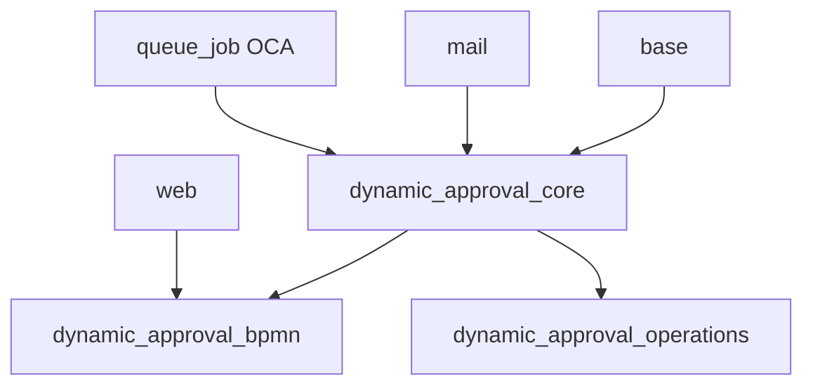
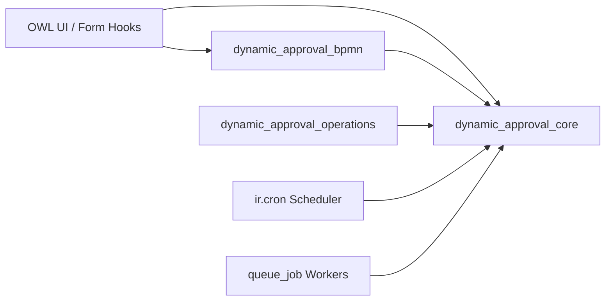
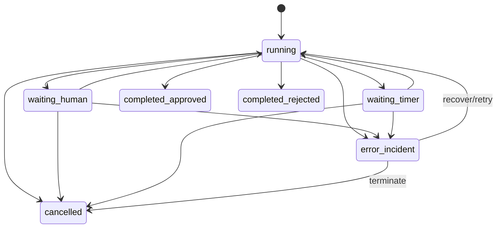

# Software Design Specification (SDS) — Dynamic Approval Workflow

Version: `v1.0-draft`  
Date: `2026-03-01`  
Author: `Tech Lead`  
Status: `draft → pending sign-off`  
Source Baseline: `docs/srs/baseline/dynamic_approval_workflow_srs_v1.3.md`  
SRS Portfolio: `SRS-00..SRS-10`  
ADRs: `docs/design/adr/ADR-001..ADR-005`  
Supersedes: `v0.2-draft` (backup: `sds_dynamic_approval_workflow_v0.2_backup.md`)

---

## 1. Purpose

Define architecture and implementation constraints for `dynamic_approval_workflow` in Odoo 19 so AI agents can implement deterministically from approved design decisions instead of making independent architecture choices.

This document translates:

1. SRS requirements (`FR-*`, `NFR-*`)
2. Detailed requirements (`DFR-*`)
3. Governance constraints from `srs_to_development_bridge_plan.md`

into binding technical design decisions for OMB and ITM.

## 2. Architecture Principles

1. Odoo-native first: use Odoo ORM, security, cron, mail, and attachment primitives before custom infrastructure.
2. Deterministic runtime: state transitions, token updates, and gate outcomes must be reproducible and auditable.
3. Strict traceability: each architecture decision maps to explicit `DFR-*` and `FR/NFR` IDs.
4. Multi-company by default: no cross-company data visibility unless explicitly allowed by policy.
5. Safety over convenience: `orm_enforced` is canonical enforcement path for compliance-critical workflows.
6. OCA alignment first: module packaging, naming, manifests, security, tests, and linting follow OCA conventions.
7. Fail-closed: enforcement and integrity checks default to blocking on error, not permitting.
8. Async dispatch: external communication (webhooks, notifications, callbacks) executes post-commit via queue_job.

## 3. Module Structure

> **ADR-001:** `docs/design/adr/ADR-001-three-module-architecture.md`

### 3.1 Decision

Implement as a **3-addon suite**: `dynamic_approval_core`, `dynamic_approval_bpmn`, `dynamic_approval_operations`. Each module has clear acceptance criteria and OCA-template compliance.

### 3.2 Structure

```text
dynamic_approval_workflow/                      # OCA-style repository root
  setup/
  .pre-commit-config.yaml
  dynamic_approval_core/
  dynamic_approval_bpmn/
  dynamic_approval_operations/
```

Each addon follows OCA template shape:

```text
dynamic_approval_<domain>/
  __init__.py
  __manifest__.py
  models/
  views/
  security/
  data/
  demo/
  readme/
  tests/
  static/            # only where UI/assets are required
  migrations/        # versioned when schema evolves
```

### 3.3 Rationale

1. Three modules balance separation of concerns (diagram UI, business logic, ops tooling) without the overhead of 6 micro-modules.
2. `dynamic_approval_core` is self-sufficient — it can run without BPMN or ops modules for headless/API-driven deployments.
3. `dynamic_approval_bpmn` isolates the heavy bpmn-js JavaScript dependency so it is not loaded for non-designer users.
4. `dynamic_approval_operations` isolates monitoring/retention/purge so it can be omitted in dev/test environments.
5. No circular dependencies — dependency flows one direction: `bpmn → core`, `operations → core`.

### 3.4 Module Responsibilities

| Module | Responsibility Scope | Depends On |
|---|---|---|
| `dynamic_approval_core` | Definitions, versioning, bindings, enforcement interceptor, runtime engine, tasks, approvers, signatures, access grants, notifications, webhooks, idempotency, incidents, audit events, security groups, mixins, callback execution | `base`, `mail`, `queue_job` |
| `dynamic_approval_bpmn` | BPMN modeler OWL component, BPMN viewer component, diagram assets, validation engine, compilation logic, bpmn-js library bundling | `dynamic_approval_core`, `web` |
| `dynamic_approval_operations` | Ops dashboard, retention policies, archival/purge jobs, SLO tracking, metrics, traceability reporting | `dynamic_approval_core` |

### 3.5 Dependency Graph



### 3.6 Module Acceptance Criteria

Each module must independently satisfy:

| Criterion | Verification Command |
|---|---|
| **Installable** | `odoo-bin -d test_db -i <module> --stop-after-init` |
| **Tests pass** | `odoo-bin -d test_db --test-tags /<module>` |
| **Lint clean** | `ruff check <module>` + `pre-commit run --all-files` |
| **Security complete** | All models have `ir.model.access.csv` entries |
| **Manifest valid** | OCA-compliant `__manifest__.py` with `19.0.x.y.z` version |
| **README present** | `readme/DESCRIPTION.rst` exists |
| **No import errors** | `python -m py_compile` on all `.py` files |

### 3.7 OCA Template Constraints

1. Every addon has independent `__manifest__.py` with OCA-compatible keys and version format (`19.0.x.y.z`).
2. One model per Python file where practical; no oversized monolithic model files.
3. Security rules and ACLs stored per addon; cross-addon security references use stable XML IDs.
4. `readme/` content and tests are mandatory per addon.
5. Lint/quality pipeline uses `pre-commit`, `pylint-odoo`, and repository-wide conventions.
6. Manifest metadata must include license (`AGPL-3`), author attribution, and repository website.

### 3.8 Traceability

- `DFR-01-*`, `DFR-02-*`, `DFR-03-*`, `DFR-04-*`, `DFR-05-*`, `DFR-06-*`, `DFR-07-*`, `DFR-08-*`, `DFR-09-*`, `DFR-10-*`
- `FR-001..096`, `NFR-001..017` (scope-specific by sub-domain)

## 4. Model Inheritance Strategy

### 4.1 Decision

Create dedicated `_name` models for workflow domain entities and avoid per-business-model source edits for gate enforcement.

### 4.2 Rules

1. New domain models use `_name` (for example `workflow.definition`, `workflow.instance`, `workflow.task`).
2. Optional mixins (`mail.thread`, `mail.activity.mixin`) applied only where collaboration/audit is required.
3. Core business models (for example `sale.order`, `purchase.order`) are not hard-modified for gating logic.
4. Generic interceptor enforces bindings at method level based on configuration.

### 4.3 Rationale

1. Matches `DFR-02-015` requirement for generic enforcement without per-model edits.
2. Reduces migration risk and keeps coupling low.

### 4.4 Traceability

- `DFR-02-001`, `DFR-02-009..015`, `DFR-07-006`
- `FR-007`, `FR-090..095`, `NFR-017`

## 5. BPMN Integration Architecture

> **ADR-003:** `docs/design/adr/ADR-003-bpmn-owl-lazy-loading.md`

### 5.1 Decision

Use `bpmn-js` in OWL 2 components for both modeler and runtime viewer, with lazy asset loading so the bpmn-js library is not bundled into the main web assets.

### 5.2 Architecture

1. `BpmnModeler` OWL component for authoring: palette, drag-drop, property panel, undo/redo, keyboard navigation for `tab`, `enter`, `escape`, `delete`, `ctrl+z`, `ctrl+y`, `arrow keys` (`FR-013`, `FR-014`).
2. `BpmnViewer` OWL component for runtime read-only visualization with overlay engine (`FR-016`, `FR-020`).
3. Canonical source of truth: `bpmn_xml` on definition version (`DFR-03-003`).
4. Compile service generates deterministic runtime artifact keyed by canonical hash.
5. Validation contract returns structured errors: `element_id`, `element_type`, `xpath_location`, `error_category`, `error_code`, `remediation_hint`.
6. Supported BPMN subset: Start event, End event, User task, Exclusive gateway, Parallel gateway, Intermediate timer event, Sequence flow.

### 5.3 Bundle Strategy

1. bpmn-js is loaded **on-demand** only when modeler/viewer is first mounted.
2. Bundle path: `dynamic_approval_bpmn/static/lib/bpmn-js/` (pre-built distribution).
3. Dedicated asset bundle `dynamic_approval_bpmn.bpmn_assets` loaded via `loadJS()` in `onWillStart`.
4. SCSS scoped via CSS class prefix `.o_daw_`.

### 5.4 Overlay Update Strategy

- **Incremental updates**: Polling (5s interval when visible) for runtime state.
- **No full reparse**: Overlays apply CSS classes and tooltips to existing SVG elements via bpmn-js overlay API.
- **State mapping**: `node_runtime.state` → CSS class (`o_daw_node_active`, `o_daw_node_completed`, `o_daw_node_pending`, `o_daw_node_error`).

### 5.5 Traceability

- `DFR-03-001..009`
- `FR-013..020`, `NFR-009`

## 6. Runtime Engine Design

> **ADR-004:** `docs/design/adr/ADR-004-runtime-hybrid-scheduler.md`

### 6.1 Decision

Use a **synchronous transactional tick** for immediate state transitions plus a **hybrid scheduler** (ir.cron for periodic scanning + OCA queue_job for async execution) for time-based actions, callbacks, notifications, and webhooks.

### 6.2 Runtime Pattern

1. **Synchronous transactional tick** for user/system decision events:
   - Acquire per-instance advisory lock (`pg_advisory_xact_lock`).
   - Load instance state + active tokens + node runtimes.
   - Evaluate node completion and guard conditions.
   - Resolve outgoing paths via gateway/condition.
   - Create next activations and tasks/timers.
   - Persist all state changes atomically (single transaction).
   - Release lock on transaction commit.
2. **Post-commit dispatch** to queue_job for async work:
   - Notification delivery (email, in-app).
   - Webhook event dispatch.
   - Post-approval callback execution.
   - Access grant creation/revocation.

### 6.3 Hybrid Scheduler Architecture

| Component | Mechanism | Purpose | Interval |
|---|---|---|---|
| Timer discovery | `ir.cron` | Scan for expired timers/SLAs | 1 minute |
| SLA checker | `ir.cron` | Scan for approaching/breached SLA deadlines | 5 minutes |
| Grant reconciliation | `ir.cron` | Detect and heal orphan access grants | 1 hour |
| Deadline checker | `ir.cron` | Scan for approaching task deadlines | 5 minutes |
| Timer execution | `queue_job` | Execute discovered expired timer action | On-demand (enqueued by cron) |
| Callback execution | `queue_job` | Execute post-approval callbacks | On-demand (enqueued by tick) |
| Webhook dispatch | `queue_job` | Deliver webhook events with retry | On-demand (enqueued by tick) |
| Notification send | `queue_job` | Render and deliver notifications | On-demand (enqueued by tick) |

**Rationale:** Cron handles periodic scanning (bounded, predictable). `queue_job` handles individual async work items with retry, backoff, and dead-letter semantics. Separation gives lower latency for individual items while maintaining predictable scanning intervals.

### 6.4 Concurrency Control

| Mechanism | Implementation |
|---|---|
| Per-instance lock | `pg_advisory_xact_lock(hash('workflow.instance', instance_id))` |
| Lock timeout | 10 seconds (configurable via `ir.config_parameter`) |
| Lock contention | 3 retries, 100ms base backoff, 2× factor, 800ms cap |
| Transaction boundary | Single `cr` transaction — lock acquired and released within same cursor |
| Post-commit dispatch | Lock window excludes external dispatch operations |

### 6.5 State Semantics

Use instance and node state contracts from `SRS-04`: `running`, `waiting_human`, `waiting_timer`, terminal states (`completed_approved`, `completed_rejected`, `cancelled`), `error_incident`.

Precedence: `error_incident` > terminals > `running` > `waiting_human` > `waiting_timer`.

### 6.6 Token Management

| Operation | Implementation |
|---|---|
| Sequential advance | Consume current → create one downstream |
| Parallel split | Consume current → create N children (one per branch) |
| Join (`all`) | Wait for all siblings; last arrival triggers downstream |
| Join (`any`) | First qualifying triggers downstream; cancel remainder with `branch_superseded` |
| Join (`quorum`) | Count qualifying vs threshold; trigger when met |
| Cancellation | Cancel token → cascade cancel downstream + children |
| Rework loop | Cancel branch tokens → create new token at rework target |

Tokens are **never deleted** — state transitions only (`active` → `consumed` / `cancelled`).

### 6.7 queue_job Retry Policy

| Job type | Max retries | Backoff | On exhaustion |
|---|---|---|---|
| Callback | 3 | 5s, 30s, 120s | Create incident |
| Webhook | 5 | 5s, 15s, 60s, 300s, 300s | Move to dead-letter queue |
| Notification | 3 | 5s, 30s, 120s | Log warning + create incident |
| Timer action | 3 | 1s, 5s, 30s | Create incident |

### 6.8 Traceability

- `DFR-04-001..014`, `DFR-05-011..013`, `DFR-09-002`
- `FR-021..028`, `FR-073`, `FR-082`, `NFR-002`, `NFR-004`

## 7. ORM Interceptor Design

> **ADR-002:** `docs/design/adr/ADR-002-full-patch-method-enforcement.md`

### 7.1 Decision

Implement **full `_patch_method` wrapping for all bound models from day one**. Every model+method pair with an active `orm_enforced` or `hybrid` binding is wrapped at registry load time. No phased rollout — all enforcement channels are covered immediately.

### 7.2 Interceptor Lifecycle

1. **Registry load/update** (`Registry._init_modules` or equivalent hook):
   - Read all active `workflow.binding` records.
   - For each binding with `enforcement_mode` in (`orm_enforced`, `hybrid`):
     - Build `(target_model, target_action_method)` pair.
     - Call `cls._patch_method(target_action_method, wrapper_fn)` on target model class.
   - Store `interceptor_config_revision` (monotonic counter).

2. **Configuration change** (binding created/modified/archived):
   - Increment `interceptor_config_revision`.
   - Signal registry reload via `registry.signal_changes()`.
   - Workers detect stale revision and re-apply patches.

3. **Wrapper function**:
   ```python
   def _workflow_intercept_wrapper(self, *args, **kwargs):
       # 1. Check for internal bypass token
       # 2. Resolve active binding for (model._name, method_name)
       # 3. Evaluate gate: blocked / allowed / allowed_with_warning
       # 4. If blocked: raise WorkflowGateBlockedError
       # 5. On evaluation error: fail-closed (block)
       # 6. Audit log the interception event
       # 7. Call original method
       return original_method(self, *args, **kwargs)
   ```

### 7.3 Channel Coverage

| Channel | Covered | Mechanism |
|---|---|---|
| Form button click | Yes | UI calls method via RPC → patched |
| JSON-RPC / XML-RPC | Yes | All calls route through patched method |
| Import/batch scripts | Yes | Import uses `create/write` → patched |
| Automated/server actions | Yes | Server actions call Python methods → patched |
| Cron/scheduled jobs | Yes | Cron calls Python methods → patched |
| `sudo()` invocations | Yes | `_patch_method` wraps the class, not the recordset |
| Direct SQL | **No** | Out of scope — documented limitation |

### 7.4 Fail-Closed Behavior

| Mode | On interceptor error | On gate evaluation error |
|---|---|---|
| `orm_enforced` | Block action | Block action |
| `hybrid` | Block action | Block action |
| `ui_only` | N/A | N/A |

### 7.5 Bypass Mechanism

1. **No client-side bypass flags** (SRS-02 §7.6.4).
2. Server-side internal bypass via `context` key `_workflow_bypass_token` — only set by the engine itself.
3. Every bypass is audit-logged with reason.

### 7.6 `ui_only` Enforcement

- `ui_only` bindings do **not** get `_patch_method` wrapping.
- They are enforced only through the frontend hook (`evaluate_gate` RPC).
- `ui_only` is **forbidden** for `compliance_critical` bindings — blocked at binding creation.

### 7.7 Traceability

- `DFR-02-002..011`, `DFR-02-015`
- `FR-008..012`, `FR-081`, `FR-090..092`, `NFR-011`, `NFR-017`

## 8. Error and Incident Pattern

### 8.1 Decision

Use typed workflow exceptions and immutable incident records with controlled retry/recover/cancel operations.

### 8.2 Exception Hierarchy

```python
class WorkflowError(UserError):
    """Base exception for all workflow errors."""

class WorkflowGateBlockedError(WorkflowError):
    """Action blocked by workflow gate."""

class WorkflowConfigurationError(WorkflowError):
    """Invalid workflow configuration."""

class WorkflowRuntimeError(WorkflowError):
    """Runtime engine failure."""

class WorkflowLockTimeoutError(WorkflowRuntimeError):
    """Per-instance lock acquisition timeout."""

class WorkflowCallbackError(WorkflowError):
    """Callback execution failure."""

class WorkflowIdempotencyConflictError(WorkflowError):
    """Same idempotency key with different payload."""

class WorkflowIntegrityError(WorkflowError):
    """Evidence hash mismatch or data integrity failure."""

class WorkflowSecurityPolicyError(WorkflowError):
    """Security policy violation."""
```

### 8.3 Incident Contract

1. Every incident has category, reason code, correlated record, and recovery policy.
2. Incident lifecycle is auditable and immutable in history.
3. Recovery actions are explicit and permission-controlled.

### 8.4 Auto-Created Incidents

| Trigger | Category | Severity |
|---|---|---|
| Callback failure (after retry exhaustion) | `callback_failure` | High |
| Empty approver set with no fallback | `resolution_failure` | High |
| Gate evaluation error in `orm_enforced` | `enforcement_failure` | Critical |
| Timer/escalation execution failure | `timer_failure` | High |
| Evidence integrity check failure | `integrity_failure` | Critical |
| Dead-letter webhook event | `webhook_failure` | Medium |

### 8.5 Incident Resolution Actions

| Action | Effect |
|---|---|
| `retry` | Re-enqueue failed operation via queue_job |
| `manual_resolution_link` | Operator links to external resolution record |
| `close_with_exception` | Mark closed with documented exception reason |

### 8.4 Traceability

- `DFR-02-014`, `DFR-04-008`, `DFR-09-002`, `DFR-10-004c`
- `FR-068`, `FR-095`, `NFR-010`

## 9. Multi-Company Isolation

### 9.1 Decision

All persistent workflow entities are company-scoped (or explicitly global with strict policy), enforced by record rules and query domain constraints.

### 9.2 Rules

1. Primary workflow models carry `company_id = fields.Many2one('res.company', required=True, default=lambda self: self.env.company, index=True)`.
2. `ir.rule` domain enforces allowed company set: `['|', ('company_id', '=', False), ('company_id', 'in', company_ids)]`.
3. Gate evaluation uses request-time `self.env.company`, not cached values.
4. Cross-company query forbidden by default; explicit `_workflow_cross_company_allowed` flag for exceptions.
5. Callback execution runs in the company context of the instance’s `company_id`.

### 9.3 Traceability

- `DFR-07-005`, `DFR-07-006`, `DFR-07-007`
- `FR-055`, `FR-061`, `FR-079`, `NFR-007`

## 10. Idempotency Pattern

> **ADR-005:** `docs/design/adr/ADR-005-idempotency-registry.md`

### 10.1 Decision

Implement a **dedicated model `workflow.idempotency.registry`** keyed by `(operation_type, operation_subject_ref, idempotency_key)`, with deterministic replay and conflict detection.

### 10.2 Storage Model

| Field | Type | Purpose |
|---|---|---|
| `operation_type` | `Selection` | `start`, `signal`, `complete_task`, `cancel_instance`, `reassign_task`, `execute_callback` |
| `operation_subject_ref` | `Char` | Reference to target record (e.g., `workflow.instance,42`) |
| `idempotency_key` | `Char(128)` | Client-supplied unique key |
| `operation_scope_hash` | `Char(64)` | SHA-256 of `(operation_type, operation_subject_ref, idempotency_key)` |
| `payload_hash` | `Char(64)` | SHA-256 of canonical request payload |
| `result_status` | `Selection` | `success`, `conflict`, `error` |
| `result_ref` | `Char` | Reference to operation outcome record |
| `correlation_id` | `Char(64)` | End-to-end trace ID |
| `causation_id` | `Char(64)` | Parent operation ID |
| `created_at_utc` | `Datetime` | Registration timestamp |
| `expires_at_utc` | `Datetime` | Retention expiry (governed by policy) |

**SQL constraint**: `UNIQUE(operation_scope_hash)` — guarantees at-most-once registration.

### 10.3 Idempotency Check Flow

1. Mutating operation arrives with `idempotency_key`.
2. Compute `operation_scope_hash`.
3. Attempt `INSERT` into `workflow.idempotency.registry`.
4. If INSERT succeeds (new key) → proceed with operation.
5. If INSERT violates UNIQUE (duplicate key):
   - `payload_hash` matches → return original `result_ref` (replay).
   - `payload_hash` differs → return `idempotency_conflict` error.
6. On operation completion → update `result_status` and `result_ref`.

### 10.4 Correlation Propagation

1. Every incoming operation receives or generates a `correlation_id`.
2. Sub-operations set `causation_id` = parent operation’s `correlation_id`.
3. All audit events include both `correlation_id` and `causation_id`.
4. End-to-end trace reconstruction via correlation chain.

### 10.5 Open Item (Blocking)

Retention window (`TTL`) is not yet baseline-locked (Bridge blocker `#23`).  
Interim default: 90 days, configurable via `ir.config_parameter`, marked for ops sign-off.

### 10.6 Traceability

- `DFR-10-001`, `DFR-10-002`, `DFR-10-003`
- `NFR-016`

## 11. Access Grant and Caching Strategy

### 11.1 Decision

Use explicit temporary access grant records plus deterministic revocation/reconciliation jobs; do not grant broad persistent permissions.

### 11.2 Pattern

1. Create `workflow.access.grant` on task assignment where required.
2. Scope grant to record/action and expiry conditions.
3. Grant TTL: 5 min – 72 hours (default 24 hours, configurable per binding).
4. Revoke on completion/cancellation/expiry.
5. Cron reconciliation detects and heals orphan grants (every 1 hour).
6. Dynamic `ir.rule` references active grants to expand read access.

### 11.3 Cache Invalidation

1. Invalidate permission cache when grants are created/revoked.
2. Invalidation events are auditable.

### 11.4 Traceability

- `DFR-07-001..005`
- `FR-051..055`, `NFR-010`

## 12. External Integration Architecture

### 12.1 Decision

Use outbound event model + delivery worker with signed payloads, retry policy, and dead-letter handling.

### 12.2 Pattern

1. Lifecycle event persisted as `workflow.outbound.event` before dispatch attempt.
2. Post-commit enqueue via `queue_job` for delivery.
3. HMAC-SHA256 signature generation per endpoint secret using RFC-8785 canonical JSON.
4. Replay window: 300 seconds (SRS-08 §8.4).
5. Retry: max 5, backoff 5s/15s/60s/300s/300s.
6. Dead-letter terminal state with operator recovery tools.
7. Replay uses original `idempotency_key` to prevent consumer duplication.

### 12.3 Schema Governance

1. Every payload includes `schema_version`.
2. Version evolution follows compatibility rules from SRS-10.

### 12.4 Traceability

- `DFR-08-001..006`, `DFR-10-004a..004d`
- `FR-056..060`, `FR-083`, `NFR-005`

## 13. Signature and Evidence Storage

### 13.1 Decision

Store evidence artifacts via `ir.attachment` with immutable metadata records (`workflow.signature.evidence`) that reference attachment checksum/hash and policy context.

### 13.2 Contract

1. Evidence metadata stored in `workflow.signature.evidence` model fields (relational, queryable, auditable).
2. Drawn signature images stored as `ir.attachment` linked to evidence record (Odoo-native, configurable backend).
3. Evidence hash: SHA-256 of canonical evidence payload.
4. Evidence records are **immutable** after creation (`write` override blocks immutable fields; `unlink` blocked entirely).
5. Corrections require superseding evidence with linkage and reason.
6. Signature-required steps cannot complete without valid evidence artifact.
7. Attestation outcomes (`system_attestation`) are explicitly distinguished from human signatures (`human_signature`) in audit outputs.

### 13.3 Open Item (Blocking)

Cryptographic suite baseline is unresolved (Bridge blocker `#15`).  
Integrity algorithms and signature-profile policy are provisional until Security Lead sign-off.

### 13.4 Traceability

- `DFR-06-001..007`
- `FR-043..046`, `FR-084`, `FR-085`, `FR-096`, `NFR-006`

## 14. Retention and Archival Design

### 14.1 Decision

Use policy-driven archival and purge jobs for completed runtime data and logs, with legal hold override support.

### 14.2 Pattern

1. Retention profiles: `short_term` (90d), `standard` (365d), `compliance_extended` (7y).
2. Archival job (cron-driven) marks eligible completed instances `active=False`.
3. Eligibility: terminal state + all child tasks terminal + all callbacks resolved + retention elapsed + no `legal_hold`.
4. Purge jobs operator-triggered, legal-hold-aware, produce immutable purge report.
5. Audit evidence of archival/purge operations is immutable.

### 14.3 Traceability

- `DFR-09-005`, `DFR-06-007`
- `FR-076`, `NFR-006`, `NFR-013`

## 15. Security Architecture

### 15.1 Security Groups

| Group XML ID | Name | Implied By | Permissions |
|---|---|---|---|
| `group_workflow_approver` | Workflow Approver | `base.group_user` | Read tasks, approve/reject, view assigned instances |
| `group_workflow_designer` | Workflow Designer | `group_workflow_approver` | Create/edit definitions, manage bindings, view all instances |
| `group_workflow_admin` | Workflow Administrator | `group_workflow_designer` | Full CRUD on all workflow models, manage security, resolve incidents |
| `group_workflow_auditor` | Workflow Auditor | `base.group_user` | Read-only access to all workflow models, audit events, evidence |

### 15.2 Access Grant Mechanism

1. Task assignment creates `workflow.access.grant` record.
2. Grant TTL: 5 min – 72 hours (default 24 hours, configurable per binding).
3. Dynamic `ir.rule` references active grants to expand read access to gated record.
4. Grant revoked on: task completion, reassignment, TTL expiry, instance cancellation.
5. All grant lifecycle events are audit-logged.

## 16. File Structure

```
dynamic_approval_core/
├── __init__.py
├── __manifest__.py
├── readme/
│   ├── DESCRIPTION.rst
│   ├── USAGE.rst
│   └── CONTRIBUTORS.rst
├── models/
│   ├── __init__.py
│   ├── workflow_definition.py
│   ├── workflow_definition_version.py
│   ├── workflow_definition_compiled.py
│   ├── workflow_binding.py
│   ├── workflow_binding_scope.py
│   ├── workflow_enforcement_interceptor.py
│   ├── workflow_instance.py
│   ├── workflow_node_runtime.py
│   ├── workflow_token.py
│   ├── workflow_decision_event.py
│   ├── workflow_task.py
│   ├── workflow_task_transition.py
│   ├── workflow_approver_resolution.py
│   ├── workflow_delegation_record.py
│   ├── workflow_follower_rule.py
│   ├── workflow_condition_rule.py
│   ├── workflow_signature_evidence.py
│   ├── workflow_attestation_policy.py
│   ├── workflow_access_grant.py
│   ├── workflow_access_grant_log.py
│   ├── workflow_notification_template.py
│   ├── workflow_notification_log.py
│   ├── workflow_webhook_endpoint.py
│   ├── workflow_outbound_event.py
│   ├── workflow_idempotency_registry.py
│   ├── workflow_incident.py
│   ├── workflow_audit_event.py
│   └── workflow_approval_mixin.py
├── views/
│   ├── workflow_definition_views.xml
│   ├── workflow_binding_views.xml
│   ├── workflow_instance_views.xml
│   ├── workflow_task_views.xml
│   ├── workflow_incident_views.xml
│   ├── workflow_webhook_views.xml
│   └── menu_views.xml
├── security/
│   ├── workflow_security.xml
│   └── ir.model.access.csv
├── data/
│   ├── workflow_data.xml
│   ├── mail_template_data.xml
│   └── ir_cron_data.xml
├── demo/
│   └── workflow_demo.xml
├── controllers/
│   └── main.py
├── wizards/
│   └── __init__.py
└── tests/
    ├── __init__.py
    ├── test_workflow_definition.py
    ├── test_workflow_binding.py
    ├── test_workflow_enforcement.py
    ├── test_workflow_runtime.py
    ├── test_workflow_task.py
    ├── test_workflow_idempotency.py
    └── test_workflow_security.py

dynamic_approval_bpmn/
├── __init__.py
├── __manifest__.py
├── readme/
│   ├── DESCRIPTION.rst
│   └── CONTRIBUTORS.rst
├── models/
│   ├── __init__.py
│   ├── workflow_diagram_asset.py
│   └── workflow_diagram_validation_result.py
├── views/
│   ├── workflow_diagram_views.xml
│   └── menu_views.xml
├── security/
│   └── ir.model.access.csv
├── static/
│   ├── lib/
│   │   └── bpmn-js/
│   ├── src/
│   │   ├── components/
│   │   │   ├── bpmn_modeler/
│   │   │   │   ├── bpmn_modeler.js
│   │   │   │   ├── bpmn_modeler.xml
│   │   │   │   └── bpmn_modeler.scss
│   │   │   └── bpmn_viewer/
│   │   │       ├── bpmn_viewer.js
│   │   │       ├── bpmn_viewer.xml
│   │   │       └── bpmn_viewer.scss
│   │   └── fields/
│   │       └── bpmn_field.js
│   └── description/
│       └── icon.png
└── tests/
    ├── __init__.py
    └── test_bpmn_validation.py

dynamic_approval_operations/
├── __init__.py
├── __manifest__.py
├── readme/
│   ├── DESCRIPTION.rst
│   └── CONTRIBUTORS.rst
├── models/
│   ├── __init__.py
│   ├── workflow_retention_policy.py
│   └── workflow_archive_job.py
├── views/
│   ├── workflow_operations_dashboard.xml
│   ├── workflow_retention_views.xml
│   └── menu_views.xml
├── security/
│   └── ir.model.access.csv
├── wizards/
│   ├── __init__.py
│   ├── workflow_purge_wizard.py
│   └── workflow_archive_wizard.py
├── data/
│   └── ir_cron_data.xml
└── tests/
    ├── __init__.py
    ├── test_retention.py
    └── test_archival.py
```

## 17. Performance Design Targets

| NFR | Target | Design Decision |
|---|---|---|
| NFR-002 (< 2s transition) | Lock + tick < 500ms; async post-commit dispatch | Single-transaction tick; queue_job for notifications/webhooks |
| NFR-003 (1k approvals/day) | No global lock bottleneck | Advisory lock per-instance; parallel instances independent |
| NFR-003 (500 concurrent) | Connection pooling | Odoo standard pool |
| NFR-004 (strong consistency) | Single-transaction atomic state change | `pg_advisory_xact_lock` within `cr` transaction |
| NFR-009 (< 1.5s viewer load) | Lazy load bpmn-js; pre-compiled diagram | No full re-parse on state change; incremental overlay |

### 17.1 Critical Indexes

| Model | Index | Purpose |
|---|---|---|
| `workflow.instance` | `(state, company_id)` | Dashboard/SLA queries |
| `workflow.task` | `(status, assignee_user_id, company_id)` | Task inbox query |
| `workflow.task` | `(instance_id, status)` | Instance detail view |
| `workflow.token` | `(instance_id, state)` | Runtime tick load |
| `workflow.audit.event` | `(correlation_id)` | Trace reconstruction |
| `workflow.audit.event` | `(object_ref, occurred_at)` | Per-record audit timeline |
| `workflow.idempotency.registry` | `(operation_scope_hash)` UNIQUE | Idempotency check |
| `workflow.outbound.event` | `(state, created_at)` | Webhook dispatch queue |
| `workflow.binding` | `(target_model, target_action_method, enforcement_mode)` | Interceptor lookup |

## 18. End-to-End Architecture Views

### 15.1 Logical Component View



### 15.2 Runtime State Transition (Simplified)



## 19. Binding Constraints for OMB and ITM

1. OMB must keep the **three-module split** from Section 3; no further splitting or collapsing.
2. OMB must assign each model/view/security artifact to exactly one owning addon.
3. ITM tasks must be module-scoped and include manifest dependency updates when cross-addon references are introduced.
4. OMB must include `queue_job` dependency on `dynamic_approval_core` for async dispatch.
5. OMB must model idempotency as dedicated registry (`workflow.idempotency.registry`), not ad-hoc fields.
6. ITM tasks implementing signature/evidence and idempotency TTL must include blocker tags for unresolved baseline decisions.
7. ITM tasks for enforcement must validate behavior in **all channels** (UI, RPC, import, server action, cron, sudo).
8. OMB security definitions must enforce multi-company domains on all runtime objects.
9. All addon manifests, readme folders, and tests must remain OCA-template compliant.
10. Each ITM task must produce **at most 3 files** and be independently verifiable.

## 20. Open Decisions and Interim Defaults

| ID | Topic | Current State | Owner | Required Before |
|---|---|---|---|---|
| OI-15 | Crypto algorithm suite baseline | Blocked (Security decision pending) | Security Lead | Phase 4 completion |
| OI-23 | Idempotency TTL duration | Blocked (Ops + Tech decision pending) | Tech Lead + Ops | Phase 6 completion |

If OI-15 or OI-23 remain unresolved by Phase 3 completion, interim defaults are adopted (SHA-256/HMAC-SHA256 and 90-day TTL respectively) and flagged as calibration items.

## 21. Decision Log (ADR) Index

| ADR | Title | File | Status |
|---|---|---|---|
| ADR-001 | Three-Module Architecture | `docs/design/adr/ADR-001-three-module-architecture.md` | Accepted |
| ADR-002 | Full `_patch_method` Enforcement | `docs/design/adr/ADR-002-full-patch-method-enforcement.md` | Accepted |
| ADR-003 | bpmn-js OWL Lazy Loading | `docs/design/adr/ADR-003-bpmn-owl-lazy-loading.md` | Accepted |
| ADR-004 | Runtime Hybrid Scheduler | `docs/design/adr/ADR-004-runtime-hybrid-scheduler.md` | Accepted |
| ADR-005 | Dedicated Idempotency Registry | `docs/design/adr/ADR-005-idempotency-registry.md` | Accepted |

## 22. Traceability

| SDS Section | SRS Source | ADR |
|---|---|---|
| §3 Module architecture | SRS-00, SRS-01..10 | ADR-001 |
| §4 Model inheritance | Parent SRS §9, §18 | — |
| §5 BPMN integration | SRS-03, Parent SRS §5.3 | ADR-003 |
| §6 Runtime engine | SRS-04, Parent SRS §8 | ADR-004 |
| §7 ORM enforcement | SRS-02 §7, Brainstorm doc | ADR-002 |
| §8 Error handling | SRS-02 §11, SRS-04 §12, SRS-09 §7 | — |
| §9 Multi-company | NFR-007, FR-079 | — |
| §10 Idempotency | SRS-10 §6–7, NFR-016 | ADR-005 |
| §11 Access grants | SRS-07, NFR-010 | — |
| §12 Notifications/webhooks | SRS-08 | — |
| §13 Signature/evidence | SRS-06, NFR-006 | — |
| §14 Retention | SRS-09 | — |
| §15 Security | SRS-07 | — |
| §16 File structure | ADR-001 | ADR-001 |
| §17 Performance | NFR-001..004, NFR-009 | — |

## 23. Sign-off

| Role | Name | Date | Approval |
|---|---|---|---|
| Tech Lead | | | |
| Product Owner | | | |
| QA Lead | | | |
| Security Lead | | | |
