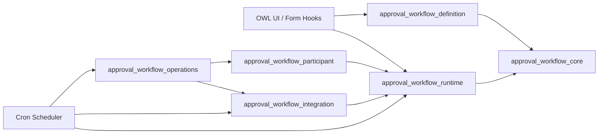
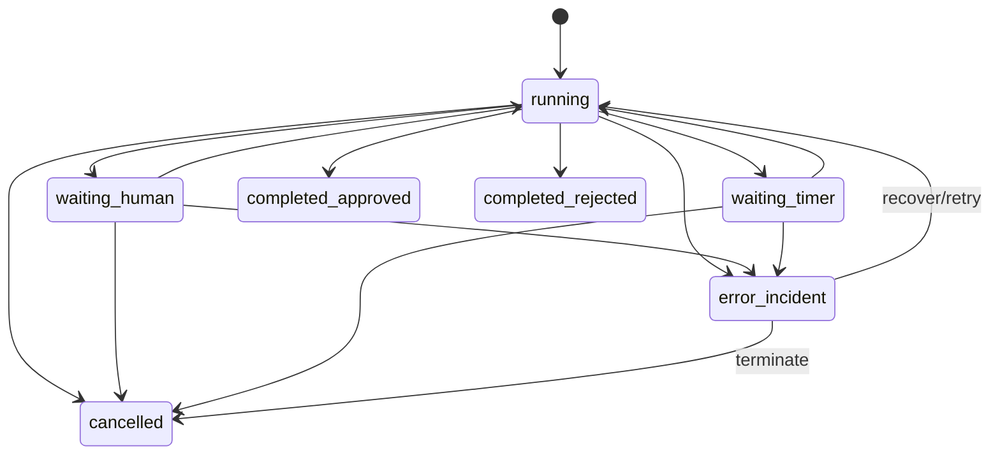

# Software Design Specification (SDS) — Dynamic Approval Workflow

Version: `v0.2-draft`  
Date: `2026-03-01`  
Author: `Tech Lead`  
Status: `draft`  
Source Baseline: `docs/srs/baseline/dynamic_approval_workflow_srs_v1.3.md`

---

## 1. Purpose

Define architecture and implementation constraints for `dynamic_approval_workflow` in Odoo 19 so AI agents can implement deterministically from approved design decisions instead of making independent architecture choices.

This document translates:

1. SRS requirements (`FR-*`, `NFR-*`)
2. Detailed requirements (`DFR-*`)
3. Governance constraints from `srs_to_development_bridge_plan.md`

into binding technical design decisions for OMB and ITM.

## 2. Architecture Principles

1. Odoo-native first: use Odoo ORM, security, cron, mail, and attachment primitives before custom infrastructure.
2. Deterministic runtime: state transitions, token updates, and gate outcomes must be reproducible and auditable.
3. Strict traceability: each architecture decision maps to explicit `DFR-*` and `FR/NFR` IDs.
4. Multi-company by default: no cross-company data visibility unless explicitly allowed by policy.
5. Safety over convenience: `orm_enforced` is canonical enforcement path for compliance-critical workflows.
6. OCA alignment first: module packaging, naming, manifests, security, tests, and linting follow OCA conventions.

### 2.1 Technical Expert Skill Invocation Matrix

Each architecture part is reviewed through a primary technical expert skill.

| SDS Section | Primary Skill | Focus |
|---|---|---|
| 3. Module Structure | `odoo-oca-developer` | OCA repository layout, addon boundaries, manifests |
| 4. Model Inheritance Strategy | `odoo-development` + `odoo-oca-developer` | ORM extension patterns and OCA packaging |
| 5. BPMN Integration Architecture | `odoo-development` | OWL/assets/backend interface |
| 6. Runtime Engine Design | `odoo-development` | Transactional orchestration and cron behavior |
| 7. ORM Interceptor Design | `odoo-development` + `odoo-oca-developer` | Cross-channel enforcement without core hacks |
| 8. Error and Incident Pattern | `odoo-development` | Exception and incident model consistency |
| 9. Multi-Company Isolation | `odoo-development` + `odoo-oca-developer` | Record rules, company scoping, ACL strategy |
| 10. Idempotency Pattern | `odoo-development` | Deterministic replay and conflict handling |
| 11. Access Grant and Caching Strategy | `odoo-development` | Least-privilege grants and reconciliation |
| 12. External Integration Architecture | `odoo-development` | Webhook schema, retry, signing |
| 13. Signature and Evidence Storage | `odoo-development` + `odoo-oca-developer` | Immutable evidence + attachment strategy |
| 14. Retention and Archival Design | `odoo-development` | Retention/archival execution and auditability |

## 3. Module Structure

### 3.1 Decision

Implement as a multi-addon suite with one core module and bounded domain modules, following OCA addon template conventions.

### 3.2 Structure

```text
dynamic_approval_workflow/                      # OCA-style repository
  setup/
  .pre-commit-config.yaml
  approval_workflow_core/
  approval_workflow_definition/
  approval_workflow_runtime/
  approval_workflow_participant/
  approval_workflow_integration/
  approval_workflow_operations/
```

Each addon follows OCA template shape:

```text
approval_workflow_<domain>/
  __init__.py
  __manifest__.py
  models/
  views/
  security/
  data/
  demo/
  readme/
  tests/
  static/            # only where UI/assets are required
  migrations/        # versioned when schema evolves
```

### 3.3 Rationale

1. Meets requirement to split project into multiple modules while avoiding micro-modules.
2. Reduces coupling between modeling, runtime, integration, and ops concerns.
3. Aligns with OCA maintenance patterns (manifested addon boundaries, migrations, tests per addon).
4. Supports phased rollout by enabling/installing modules incrementally.

### 3.4 Module Responsibilities

| Module | Responsibility Scope | Depends On |
|---|---|---|
| `approval_workflow_core` | Shared abstractions, base mixins, common enums, audit primitives, common security groups | `base`, `mail` |
| `approval_workflow_definition` | Definition/versioning lifecycle, BPMN XML canonical storage, publish validation contracts | `approval_workflow_core` |
| `approval_workflow_runtime` | Runtime engine, token/node/instance orchestration, gate enforcement/interceptor | `approval_workflow_core`, `approval_workflow_definition` |
| `approval_workflow_participant` | Approver resolution, delegation, human tasks, signature/evidence, access grants | `approval_workflow_runtime` |
| `approval_workflow_integration` | Notifications, callbacks, outbound webhook events, idempotency registry | `approval_workflow_runtime`, `approval_workflow_participant` |
| `approval_workflow_operations` | Dashboards, incident ops tooling, retention/archive jobs, traceability exports | `approval_workflow_integration` |

### 3.5 Dependency Graph


### 3.6 OCA Template Constraints

1. Every addon has independent `__manifest__.py` with OCA-compatible keys and version format (`19.0.x.y.z`).
2. One model per Python file where practical; no oversized monolithic model files.
3. Security rules and ACLs stored per addon; cross-addon security references use stable XML IDs.
4. `readme/` content and tests are mandatory per addon.
5. Lint/quality pipeline uses `pre-commit`, `pylint-odoo`, and repository-wide conventions.
6. Manifest metadata must include OCA-compatible license (`AGPL-3` or approved alternative), author attribution, and repository website.

### 3.7 Traceability

- `DFR-01-*`, `DFR-02-*`, `DFR-03-*`, `DFR-04-*`, `DFR-05-*`, `DFR-06-*`, `DFR-07-*`, `DFR-08-*`, `DFR-09-*`, `DFR-10-*`
- `FR-001..096`, `NFR-001..017` (scope-specific by sub-domain)

## 4. Model Inheritance Strategy

**Tech Expert Skill:** `odoo-development` + `odoo-oca-developer`

### 4.1 Decision

Create dedicated `_name` models for workflow domain entities and avoid per-business-model source edits for gate enforcement.

### 4.2 Rules

1. New domain models use `_name` (for example `workflow.definition`, `workflow.instance`, `workflow.task`).
2. Optional mixins (`mail.thread`, `mail.activity.mixin`) applied only where collaboration/audit is required.
3. Core business models (for example `sale.order`, `purchase.order`) are not hard-modified for gating logic.
4. Generic interceptor enforces bindings at method level based on configuration.

### 4.3 Rationale

1. Matches `DFR-02-015` requirement for generic enforcement without per-model edits.
2. Reduces migration risk and keeps coupling low.

### 4.4 Traceability

- `DFR-02-001`, `DFR-02-009..015`, `DFR-07-006`
- `FR-007`, `FR-090..095`, `NFR-017`

## 5. BPMN Integration Architecture

**Tech Expert Skill:** `odoo-development`

### 5.1 Decision

Use `bpmn-js` in OWL components for both modeler and runtime viewer with canonical BPMN XML persisted in backend and compiled metadata generated server-side.

### 5.2 Architecture

1. `BpmnModeler` OWL component for authoring (`FR-013`, `FR-014`).
2. `BpmnViewer` OWL component for runtime read-only visualization (`FR-016`, `FR-020`).
3. Canonical source of truth: `bpmn_xml` on definition version (`DFR-03-003`).
4. Compile service generates deterministic runtime artifact keyed by canonical hash.
5. Validation contract returns structured errors with element references.

### 5.3 Bundle Strategy

1. Load BPMN assets only on designer/viewer screens (lazy asset loading).
2. Keep base backend asset bundle lean for non-design workflows.

### 5.4 Traceability

- `DFR-03-001..009`
- `FR-013..020`, `NFR-009`

## 6. Runtime Engine Design

**Tech Expert Skill:** `odoo-development`

### 6.1 Decision

Use a transactional runtime service for immediate transitions plus cron-driven schedulers for time-based actions (timeouts, reminders, escalation, retries, retention jobs).

### 6.2 Runtime Pattern

1. Synchronous transactional tick for user/system decision events.
2. Atomic state updates for instance/node/token mutation in a single transaction.
3. Cron workers for delayed semantics and retryable background operations.
4. Incident-first error halt model with explicit recovery actions.

### 6.3 State Semantics

Use instance and node state contracts from `SRS-04` (`running`, `waiting_human`, `waiting_timer`, terminal states, `error_incident`) as canonical runtime vocabulary.

### 6.4 Traceability

- `DFR-04-001..014`, `DFR-05-011..013`, `DFR-09-002`
- `FR-021..028`, `FR-073`, `FR-082`, `NFR-002`, `NFR-004`

## 7. ORM Interceptor Design

**Tech Expert Skill:** `odoo-development` + `odoo-oca-developer`

### 7.1 Decision

Implement a generic server interceptor service that validates gating policy before executing configured target business methods.

### 7.2 Pattern

1. Binding lookup by `(model, method, company, scope, priority)`.
2. Evaluate enforcement mode: `orm_enforced`, `hybrid`, `ui_only`.
3. For `orm_enforced` and `hybrid`, block execution when gate is not satisfied.
4. Return canonical gate states for UI contract: `blocked`, `allowed`, `allowed_with_warning`.

### 7.3 Constraints

1. `ui_only` mode disallowed for `compliance_critical` bindings.
2. Non-UI channels (RPC/import/server actions) must observe server gate in enforced modes.

### 7.4 Traceability

- `DFR-02-002..011`, `DFR-02-015`
- `FR-008..012`, `FR-081`, `FR-090..092`, `NFR-011`, `NFR-017`

## 8. Error and Incident Pattern

**Tech Expert Skill:** `odoo-development`

### 8.1 Decision

Use typed workflow exceptions and immutable incident records with controlled retry/recover/cancel operations.

### 8.2 Exception Families

1. `WorkflowGateBlockedError`
2. `WorkflowConfigurationError`
3. `WorkflowRuntimeError`
4. `WorkflowCallbackError`
5. `WorkflowSecurityPolicyError`

### 8.3 Incident Contract

1. Every incident has category, reason code, correlated record, and recovery policy.
2. Incident lifecycle is auditable and immutable in history.
3. Recovery actions are explicit and permission-controlled.

### 8.4 Traceability

- `DFR-02-014`, `DFR-04-008`, `DFR-09-002`, `DFR-10-004c`
- `FR-068`, `FR-095`, `NFR-010`

## 9. Multi-Company Isolation

**Tech Expert Skill:** `odoo-development` + `odoo-oca-developer`

### 9.1 Decision

All persistent workflow entities are company-scoped (or explicitly global with strict policy), enforced by record rules and query domain constraints.

### 9.2 Rules

1. Primary workflow models carry `company_id`.
2. `ir.rule` domains enforce allowed company set.
3. Scope and grant evaluation includes company boundary checks.
4. Runtime viewer and task assignment queries are company-filtered.

### 9.3 Traceability

- `DFR-07-005`, `DFR-07-006`, `DFR-07-007`
- `FR-055`, `FR-061`, `FR-079`, `NFR-007`

## 10. Idempotency Pattern

**Tech Expert Skill:** `odoo-development`

### 10.1 Decision

Implement a dedicated idempotency registry model keyed by operation scope and `idempotency_key`, with deterministic replay behavior.

### 10.2 Contract

1. Unique scope key: `(operation_name, actor_scope, idempotency_key)`.
2. Stores first outcome payload reference and correlation ID.
3. Duplicate calls return stable prior outcome.
4. Conflicting duplicate payloads are rejected deterministically.

### 10.3 Open Item (Blocking)

Retention window (`TTL`) is not yet baseline-locked (Bridge blocker `#23`).  
Interim behavior: configurable system parameter with non-final default, marked for security/ops sign-off before release.

### 10.4 Traceability

- `DFR-10-001`, `DFR-10-002`, `DFR-10-003`
- `NFR-016`

## 11. Access Grant and Caching Strategy

**Tech Expert Skill:** `odoo-development`

### 11.1 Decision

Use explicit temporary access grant records plus deterministic revocation/reconciliation jobs; do not grant broad persistent permissions.

### 11.2 Pattern

1. Create grant on task assignment where required.
2. Scope grant to record/action and expiry conditions.
3. Revoke on completion/cancellation/expiry.
4. Cron reconciliation detects and heals orphan grants.

### 11.3 Cache Invalidation

1. Invalidate permission cache when grants are created/revoked.
2. Invalidation events are auditable.

### 11.4 Traceability

- `DFR-07-001..005`
- `FR-051..055`, `NFR-010`

## 12. External Integration Architecture

**Tech Expert Skill:** `odoo-development`

### 12.1 Decision

Use outbound event model + delivery worker with signed payloads, retry policy, and dead-letter handling.

### 12.2 Pattern

1. Lifecycle event persisted before dispatch attempt.
2. HMAC signature generation per endpoint secret.
3. Retry with bounded attempts and backoff policy.
4. Dead-letter terminal state with operator recovery tools.

### 12.3 Schema Governance

1. Every payload includes `schema_version`.
2. Version evolution follows compatibility rules from SRS-10.

### 12.4 Traceability

- `DFR-08-001..006`, `DFR-10-004a..004d`
- `FR-056..060`, `FR-083`, `NFR-005`

## 13. Signature and Evidence Storage

**Tech Expert Skill:** `odoo-development` + `odoo-oca-developer`

### 13.1 Decision

Store evidence artifacts via `ir.attachment` with immutable metadata records (`workflow.signature.evidence`) that reference attachment checksum/hash and policy context.

### 13.2 Contract

1. Evidence row captures actor, method, timestamp, type, and integrity reference.
2. Evidence records are immutable after creation.
3. Signature-required steps cannot complete without valid evidence artifact.
4. Attestation outcomes are explicitly distinguished from human signatures in audit outputs.

### 13.3 Open Item (Blocking)

Cryptographic suite baseline is unresolved (Bridge blocker `#15`).  
Integrity algorithms and signature-profile policy are provisional until Security Lead sign-off.

### 13.4 Traceability

- `DFR-06-001..007`
- `FR-043..046`, `FR-084`, `FR-085`, `FR-096`, `NFR-006`

## 14. Retention and Archival Design

**Tech Expert Skill:** `odoo-development`

### 14.1 Decision

Use policy-driven archival and purge jobs for completed runtime data and logs, with legal hold override support.

### 14.2 Pattern

1. Retention policy model defines windows per artifact class.
2. Archival job moves/marks completed artifacts according to policy.
3. Purge jobs run only for eligible non-held records.
4. Audit evidence of archival/purge operations is immutable.

### 14.3 Traceability

- `DFR-09-005`, `DFR-06-007`
- `FR-076`, `NFR-006`, `NFR-013`

## 15. End-to-End Architecture Views

**Tech Expert Skill:** `odoo-development` + `odoo-oca-developer`

### 15.1 Logical Component View



### 15.2 Runtime State Transition (Simplified)



## 16. Binding Constraints for OMB and ITM

**Tech Expert Skill:** `odoo-development` + `odoo-oca-developer`

1. OMB must keep the six-module split from Section 3; no collapse to single addon.
2. OMB must align each model/view/security artifact to exactly one owning addon.
3. ITM tasks must be module-scoped and include manifest dependency updates when cross-addon references are introduced.
4. OMB must not introduce queue-framework dependency for timer handling; timers remain cron-driven in this baseline.
5. OMB must model idempotency as dedicated registry, not ad-hoc fields on unrelated models.
6. ITM tasks implementing signature/evidence and idempotency TTL must include blocker tags for unresolved baseline decisions.
7. ITM tasks for enforcement must validate behavior in UI and non-UI channels for `orm_enforced/hybrid`.
8. OMB security definitions must enforce multi-company domains on all runtime objects and integrations.
9. All addon manifests, readme folders, and tests must remain OCA-template compliant.

## 17. Open Decisions and Interim Defaults

| ID | Topic | Current State | Owner | Required Before |
|---|---|---|---|---|
| OI-15 | Crypto algorithm suite baseline | Blocked (Security decision pending) | Security Lead | Phase 4 completion |
| OI-23 | Idempotency TTL duration | Blocked (Ops + Tech decision pending) | Tech Lead + Ops | Phase 6 completion |

## 18. Decision Log (ADR) Index

Planned ADR files:

1. `docs/design/adr/ADR-001-oca-multi-module-architecture.md`
2. `docs/design/adr/ADR-002-enforcement-interceptor.md`
3. `docs/design/adr/ADR-003-runtime-cron-strategy.md`
4. `docs/design/adr/ADR-004-evidence-storage-policy.md`
5. `docs/design/adr/ADR-005-idempotency-registry.md`

## 19. Sign-off

| Role | Name | Date | Approval |
|---|---|---|---|
| Tech Lead | | | |
| Product Owner | | | |
| QA Lead | | | |
| Security Lead | | | |
