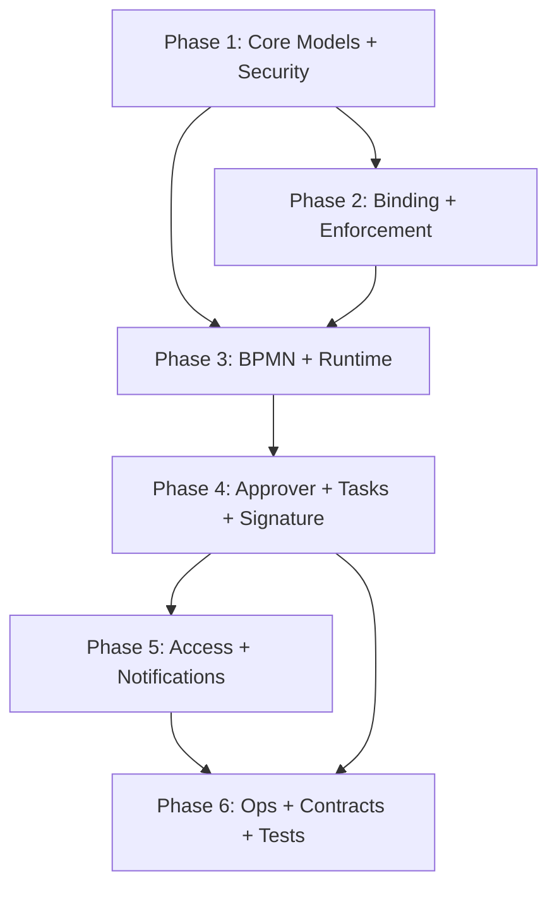

# SRS → AI Development Bridge Plan

Version: `v1.0`
Date: `2026-03-01`
Author: Tech Lead
Status: `approved`
SRS Portfolio Status: `baseline-ready-pending-2-blocking-issues`

---

## 1. Purpose

Define the document pipeline required to bridge the completed SRS portfolio (`SRS-00` through `SRS-10`) to AI-driven development using **GitHub Copilot** (interactive, workspace-mode) and **OpenAI Codex** (autonomous batch tasks). These documents translate *what* the system must do (SRS) into *how* it is built (architecture), *exactly what* to produce (field-level specs), and *in what order* (dependency-sequenced tasks).

## 2. Document Pipeline Overview

```
SRS Portfolio (SRS-00..SRS-10)
    │   95 FRs + 17 NFRs — WHAT to build
    │
    ▼
┌─────────────────────────────────────────┐
│  Document 1: Software Design            │
│  Specification (SDS)                    │  ← HOW (architecture decisions)
│                                         │
│  Odoo 19 patterns, inheritance,         │
│  integration points, error strategy     │
└──────────────────┬──────────────────────┘
                   │
                   ▼
┌─────────────────────────────────────────┐
│  Document 2: Odoo Module Blueprint      │
│  (OMB)                                  │  ← EXACTLY WHAT (field-level specs)
│                                         │
│  Model fields, view XML, security CSV,  │
│  OWL components, cron jobs              │
│  AI agents code directly from this      │
└──────────────────┬──────────────────────┘
                   │
                   ▼
┌─────────────────────────────────────────┐
│  Document 3: Implementation Task        │
│  Manifest (ITM)                         │  ← IN WHAT ORDER (agent tasks)
│                                         │
│  Dependency-ordered, self-contained     │
│  tasks for Copilot and Codex            │
└──────────────────┬──────────────────────┘
                   │
                   ▼
┌─────────────────────────────────────────┐
│  Document 4: Test & Validation Spec     │
│  + Requirements-to-Test Matrix          │  ← HOW TO PROVE (quality evidence)
│  (TVS + RTM)                            │
│                                         │
│  Test design, coverage matrix, and      │
│  release evidence requirements           │
└─────────────────────────────────────────┘
```

## 3. Document 1: Software Design Specification (SDS)

### 3.1 Purpose

Translates SRS requirements into Odoo 19 architecture decisions. This is the "HOW" document — patterns, inheritance strategy, integration points. It resolves design questions that AI agents should not decide independently.

### 3.2 Required Sections

| Section | Content | Key Decisions |
|---|---|---|
| Module structure | File/folder layout, `__manifest__.py` dependencies, addon path | Single module vs split modules |
| Model inheritance strategy | Which models use `_inherit` vs new models | Where to extend existing Odoo models vs create standalone |
| BPMN integration architecture | bpmn-js ↔ OWL component architecture, bundle strategy | JS library loading, canvas lifecycle, overlay rendering |
| Runtime engine design | Token execution pattern, cron vs queue for timers/escalation | Synchronous vs async execution, job queue approach |
| ORM interceptor design | Enforcement hook mechanism | `_patch_method` vs `create/write` override vs mixin |
| Error and incident pattern | How failures propagate, incident queue design | Exception hierarchy, recovery entry points |
| Multi-company isolation | Company-scoped record rules, cross-company isolation | `ir.rule` strategy, `company_dependent` fields |
| Idempotency pattern | How `idempotency_key` is stored and checked | Dedicated model vs field on existing models, TTL enforcement |
| Access grant / caching strategy | Temporary access grant mechanism, cache invalidation | Group membership vs record rules, invalidation triggers |
| External integration | Webhook dispatch architecture, HMAC signing | Queue mechanism, retry implementation, secret storage |
| Signature / evidence storage | Evidence artifact storage format and integrity | Binary field vs attachment vs external store |
| Retention / archival | Archive mechanism for completed workflow data | Separate archive tables vs soft delete vs Odoo archive flag |

### 3.3 Traceability

Every SDS section must reference the SRS requirements it resolves:

```
SDS Section → SRS Requirement IDs → Design Decision → Rationale
```

### 3.4 Authoring Notes for AI Agents

- SDS decisions are **binding constraints** for the Blueprint and Task Manifest.
- If the SDS says "use `_inherit`", the Blueprint must not use `_name` for that model.
- If the SDS says "cron-based timer", the Task Manifest must not implement a queue-based timer.

### 3.5 Output Artifacts

| Artifact | Path | Format |
|---|---|---|
| SDS document | `docs/design/sds_dynamic_approval_workflow.md` | Markdown |
| Architecture diagrams | `docs/design/diagrams/` | Mermaid (embedded) or PNG |
| Decision log | `docs/design/adr/` | Architecture Decision Records (numbered) |

---

## 4. Document 2: Odoo Module Blueprint (OMB)

### 4.1 Purpose

Field-level specification that AI agents can directly translate to Python models, XML views, security CSV, and JS components. **Zero ambiguity** — every field name, type, constraint, and default is explicitly stated. This is the primary input document for both Copilot and Codex.

### 4.2 Required Sections

#### 4.2.1 Model Specifications

For each Odoo model, specify:

| Attribute | Example |
|---|---|
| `_name` | `workflow.definition` |
| `_description` | `Workflow Definition` |
| `_inherit` | (if extending existing model) |
| `_order` | `name asc, id desc` |
| `_rec_name` | `display_name` |
| Fields table | See format below |
| SQL constraints | `_sql_constraints = [...]` |
| Python constraints | `@api.constrains(...)` methods |
| Compute method signatures | Method name, dependencies, logic summary |
| CRUD override signatures | Which of `create/write/unlink/copy` are overridden and why |
| Business method signatures | Method name, parameters, return type, logic summary |

**Field table format:**

| Field Name | Type | Required | Default | Index | Readonly | String | Help | Constraint Notes |
|---|---|---|---|---|---|---|---|---|
| `key` | `Char(64)` | Yes | — | Yes (unique with company_id) | After publish | `Definition Key` | `Unique identifier` | `^[a-z][a-z0-9_]{2,63}$` regex |
| `company_id` | `Many2one('res.company')` | Yes | `lambda self: self.env.company` | Yes | — | `Company` | — | Multi-company isolation |
| `state` | `Selection` | Yes | `draft` | Yes | — | `Status` | — | Values: `draft`, `published`, `archived` |

#### 4.2.2 View Specifications

For each view, specify:

| Attribute | Content |
|---|---|
| View type | `form` / `list` / `kanban` / `search` / `pivot` / `graph` |
| Model | Target model `_name` |
| Priority | View sequence priority |
| Layout structure | Groups, notebooks, pages, button bar, statusbar |
| Field placement | Which fields in which groups/pages |
| Widget overrides | e.g., `widget="statusbar"`, `widget="many2many_tags"` |
| Conditional visibility | `invisible` attribute conditions |
| Action buttons | Button name, type, method, confirm text |
| Chatter | Whether `mail.thread` / `mail.activity.mixin` is used |

#### 4.2.3 Security Specifications

**Access rights** (`ir.model.access.csv` rows):

| id | name | model_id:id | group_id:id | perm_read | perm_write | perm_create | perm_unlink |
|---|---|---|---|---|---|---|---|
| `access_workflow_definition_designer` | `workflow.definition designer` | `model_workflow_definition` | `group_workflow_designer` | 1 | 1 | 1 | 0 |

**Record rules** (`ir.rule` XML records):

| Rule name | Model | Domain filter | Groups | Global | Purpose |
|---|---|---|---|---|---|
| `workflow_definition_company_rule` | `workflow.definition` | `['|',('company_id','=',False),('company_id','in',company_ids)]` | — | Yes | Multi-company isolation |

**Security groups:**

| XML ID | Name | Implied groups | Category |
|---|---|---|---|
| `group_workflow_designer` | `Workflow Designer` | `base.group_user` | `Workflow` |
| `group_workflow_admin` | `Workflow Administrator` | `group_workflow_designer` | `Workflow` |
| `group_workflow_approver` | `Workflow Approver` | `base.group_user` | `Workflow` |
| `group_workflow_auditor` | `Workflow Auditor` | `base.group_user` | `Workflow` |

#### 4.2.4 Menu and Action Specifications

| Menu XML ID | Name | Parent | Action | Sequence | Groups |
|---|---|---|---|---|---|
| `menu_workflow_root` | `Approvals` | — | — | 50 | `group_workflow_approver` |
| `menu_workflow_definitions` | `Definitions` | `menu_workflow_root` | `action_workflow_definition` | 10 | `group_workflow_designer` |

#### 4.2.5 OWL Component Specifications

For each JavaScript/OWL component:

| Attribute | Content |
|---|---|
| Component name | e.g., `BpmnViewer`, `BpmnModeler` |
| File path | `static/src/components/bpmn_viewer/bpmn_viewer.js` |
| Props | Input properties with types |
| State | Reactive state variables |
| Events emitted | Custom events and payload structure |
| RPC calls | Backend methods invoked |
| Template | XML template file path |
| SCSS | Stylesheet file path |
| Dependencies | External libraries (e.g., bpmn-js) |

#### 4.2.6 Cron and Server Action Specifications

| XML ID | Name | Model | Method | Interval | Active | Priority |
|---|---|---|---|---|---|---|
| `ir_cron_workflow_sla_check` | `Check Workflow SLA` | `workflow.task` | `_cron_check_sla` | 5 minutes | Yes | 10 |
| `ir_cron_workflow_grant_reconcile` | `Reconcile Access Grants` | `workflow.access.grant` | `_cron_reconcile_orphan_grants` | 1 hour | Yes | 20 |

#### 4.2.7 Data and Demo Specifications

| File | Content |
|---|---|
| `data/workflow_data.xml` | Default sequences, mail templates, system parameters |
| `data/mail_template_data.xml` | Email templates for assignment, reminder, escalation, outcome |
| `demo/workflow_demo.xml` | Demo workflow definitions, bindings, sample instances |

### 4.3 Model Dependency Graph

The Blueprint must include a model dependency graph showing foreign key relationships and inheritance chains:

```
workflow.definition
    └── workflow.definition.version
         └── workflow.binding
              └── workflow.instance
                   ├── workflow.token
                   ├── workflow.task
                   │    ├── workflow.task.transition
                   │    └── workflow.signature.evidence
                   ├── workflow.instance.event (audit)
                   └── workflow.incident
```

### 4.4 Traceability

Every model and field must trace back to at least one DFR:

```
Model.field → DFR-XX-YYY → FR/NFR-ZZZ
```

### 4.5 Output Artifacts

| Artifact | Path | Format |
|---|---|---|
| Blueprint document | `docs/design/omb_dynamic_approval_workflow.md` | Markdown |
| Model relationship diagram | `docs/design/diagrams/model_erd.md` | Mermaid |

---

## 5. Document 3: Implementation Task Manifest (ITM)

### 5.1 Purpose

Dependency-ordered task list where each task is a self-contained prompt for Codex or Copilot. Each task produces 1–3 files with defined inputs and verification criteria. Tasks are grouped into phases following dependency order.

### 5.2 Task Record Format

Each task in the manifest follows this structure:

```yaml
task_id: TASK-001
title: Create workflow.definition model
phase: 1
depends_on: []
agent: codex | copilot | either
files_to_create:
  - models/workflow_definition.py
  - security/ir.model.access.csv (append)
files_to_modify: []
blueprint_sections:
  - OMB §4.2.1 workflow.definition
  - OMB §4.2.3 security groups
sds_sections:
  - SDS §module-structure
  - SDS §model-inheritance
srs_requirements:
  - FR-001, FR-002, FR-003, FR-004, FR-005, FR-006
acceptance_criteria:
  - Model installs without error
  - All fields from blueprint exist with correct types
  - SQL constraints enforced
  - Security groups created
verification_command: |
  odoo-bin -d test_db -i dynamic_approval_workflow --test-enable --stop-after-init
complexity: M  # S/M/L — for Codex token budget planning
estimated_files: 2
```

### 5.3 Implementation Phases (Dependency Order)

| Phase | Domain | SRS Source | Rationale | Est. Tasks |
|---|---|---|---|---|
| **Phase 1** | Core models + security groups | SRS-01, SRS-07 (partial) | Foundation — everything depends on `workflow.definition`, `workflow.version`, security groups | 8–12 |
| **Phase 2** | Binding + enforcement + callback | SRS-02 | Needs definitions from Phase 1; enables gating and action interception | 10–15 |
| **Phase 3** | BPMN modeler/viewer + runtime engine | SRS-03, SRS-04 | Needs definitions + bindings; enables workflow execution and diagram rendering | 15–20 |
| **Phase 4** | Approver resolution + tasks + signature | SRS-05, SRS-06 | Needs runtime engine from Phase 3; enables human approval flow | 12–18 |
| **Phase 5** | Access grants + notifications + webhooks | SRS-07 (remainder), SRS-08 | Needs tasks from Phase 4; enables temporary access, email/webhook dispatch | 10–15 |
| **Phase 6** | Ops dashboard + retention + data contracts + integration tests | SRS-09, SRS-10 | Cross-cutting; requires all above; final integration and load testing | 8–12 |

### 5.4 Phase Dependency Graph



### 5.5 Agent Assignment Guidelines

| Criteria | Use Codex | Use Copilot |
|---|---|---|
| Task type | New file creation, boilerplate models, security CSV | Complex logic, debugging, refactoring |
| Context needed | Self-contained, 1–3 file scope | Broad workspace awareness needed |
| Iteration | First-pass generation | Interactive refinement |
| Verification | Automated test pass | Manual review + adjustment |

### 5.6 Task Verification Protocol

Each completed task must pass:

1. **Syntax check** — `python -m py_compile <file>` for Python files
2. **Module install** — `odoo-bin -i dynamic_approval_workflow --stop-after-init`
3. **Unit tests** — `odoo-bin --test-enable --test-tags /dynamic_approval_workflow`
4. **Lint** — `ruff check` + `eslint` for JS files
5. **Blueprint conformance** — field names, types, and constraints match OMB exactly

### 5.7 Output Artifacts

| Artifact | Path | Format |
|---|---|---|
| Task manifest | `docs/design/itm_dynamic_approval_workflow.md` | Markdown with YAML task blocks |
| Phase dependency diagram | `docs/design/diagrams/phase_dependencies.md` | Mermaid |
| Progress tracker | `docs/design/itm_progress.md` | Updated after each task completion |

---

## 6. Document 4: Test & Validation Specification (TVS) + Requirements-to-Test Matrix (RTM)

### 6.1 Purpose

Define exactly how the solution will be validated, what test evidence is required, and how every requirement maps to executable tests and final results. This prevents "implemented but unproven" delivery.

### 6.2 Required Sections

| Section | Content | Key Decisions |
|---|---|---|
| Test strategy scope | Unit, integration, security, performance, UAT scope by SRS domain | What is in/out of release scope |
| Environment matrix | Local/CI/staging environments, seed data, company scenarios | Which environments are authoritative for sign-off |
| Functional test design | Scenario-based test cases mapped to `FR-*`/`DFR-*` | Positive, negative, edge case coverage depth |
| Non-functional validation | Reliability, retention, security, auditability checks mapped to `NFR-*` | Pass/fail thresholds |
| Data and migration tests | Upgrade/migration checks and data integrity assertions | Backward compatibility guarantees |
| Automation policy | Which tests are mandatory automated vs allowed manual | Manual-only exceptions and owner |
| Defect severity policy | Severity definitions, escape criteria, release blockers | What blocks production release |
| Exit criteria | Release readiness checklist and sign-off requirements | Minimum evidence package for go-live |

### 6.3 RTM (Requirements-to-Test Matrix) Structure

Each row must include:

| Column | Description |
|---|---|
| Requirement ID | `FR-*` or `NFR-*` |
| DFR Reference | Child requirement source (`DFR-*`) |
| Design Reference | `SDS`/`OMB` section IDs |
| Implementation Reference | `TASK-*` IDs and source files |
| Test Case IDs | `TC-*` IDs |
| Execution Type | Automated / Manual |
| Last Run Evidence | CI run link, log reference, or evidence file |
| Status | Pass / Fail / Blocked / Not Run |
| Owner | Responsible role |

### 6.4 Output Artifacts

| Artifact | Path | Format |
|---|---|---|
| Test & Validation Specification | `docs/design/tvs_dynamic_approval_workflow.md` | Markdown |
| Requirements-to-Test Matrix | `docs/design/rtm_dynamic_approval_workflow.md` | Markdown table |
| Test evidence index | `docs/design/test_evidence_index.md` | Markdown with links to logs/reports |

---

## 7. Authoring Sequence

| Step | Document | Input | Output | Est. Duration |
|---|---|---|---|---|
| 1 | **SDS** | SRS portfolio + Odoo 19 framework knowledge | Architecture decisions, patterns, ADRs | 3–5 days |
| 2 | **OMB** | SDS + SRS portfolio | Field-level model/view/security/JS specs | 5–8 days |
| 3 | **ITM** | OMB + SDS | Dependency-ordered task list with prompts | 2–3 days |
| 4 | **TVS + RTM** | SRS + SDS + OMB + ITM | Test strategy, traceability matrix, release evidence criteria | 2–3 days |
| 5 | **Development + Validation** | ITM tasks + TVS/RTM | Python, XML, JS, CSV files + executed evidence | 6–10 weeks |

```
Week 1-2:    SDS authoring + architecture review
Week 2-4:    OMB authoring (can start while SDS is in review)
Week 4-5:    ITM authoring + task dependency validation
Week 5-6:    TVS + RTM authoring and review
Week 6-16:   AI-driven development + validation (Phase 1 → Phase 6)
```

## 8. Quality Gates Between Documents

### 8.1 SRS → SDS Gate

| Check | Criterion |
|---|---|
| Coverage | Every SRS domain (SRS-01..10) has at least one SDS section |
| Decisions | No "TBD" in SDS — every design choice is resolved or has interim default |
| Constraints | SDS does not contradict any SRS requirement |
| Feasibility | All patterns are validated against Odoo 19 framework capabilities |

### 8.2 SDS → OMB Gate

| Check | Criterion |
|---|---|
| Completeness | Every model mentioned in SDS has a full field table in OMB |
| Conformance | OMB field types and patterns match SDS architecture decisions |
| Traceability | Every OMB model/field traces to at least one DFR |
| Testability | Every acceptance test in SRS has a corresponding verification path in OMB |

### 8.3 OMB → ITM Gate

| Check | Criterion |
|---|---|
| Coverage | Every OMB model/view/security spec appears in at least one ITM task |
| Ordering | No task references a model/file created by a later-phase task |
| Atomicity | Each task creates at most 3 files and can be verified independently |
| Agent-ready | Each task has explicit blueprint section references and acceptance criteria |

### 8.4 ITM → TVS/RTM Gate

| Check | Criterion |
|---|---|
| Requirement coverage | Every `FR/NFR` in scope has at least one `TC-*` mapping |
| Task coverage | Every implemented `TASK-*` has associated verification evidence expectations |
| Automation clarity | Manual vs automated status defined for each test case |
| Exit criteria defined | Release blocker criteria are explicit and measurable |

### 8.5 TVS/RTM → Development Gate

| Check | Criterion |
|---|---|
| Execution readiness | Required environments and datasets are available |
| CI readiness | Automated suites are runnable in CI with deterministic commands |
| Reporting readiness | Evidence paths and reporting format are defined |
| Ownership | QA/release owners assigned for each unresolved gap |

## 9. AI Agent Context Management

### 9.1 Codex Context Window

Codex has a limited context window. Each task must be self-contained:

- Include relevant OMB sections inline in the task prompt
- Reference only files created by prior completed tasks
- Never assume the agent "remembers" prior tasks

### 9.2 Copilot Workspace Context

Copilot operates within the VS Code workspace and can see all files:

- Keep the OMB document open as a reference file
- Use `@workspace` to give Copilot access to the full module
- Reference specific OMB sections by heading when asking for implementation

### 9.3 Prompt Templates

The ITM should include prompt templates for each task type:

| Task Type | Template Elements |
|---|---|
| New model | Model name, fields table, constraints, inheritance, file path |
| New view | Model, view type, layout description, field placement, buttons |
| Security | Access CSV rows, record rule XML, group definitions |
| OWL component | Component name, props, events, RPC calls, template structure |
| Cron job | Model, method signature, interval, logic summary |
| Test case | Test class, setup, scenario, assertion, SRS requirement ID |

## 10. Traceability Chain

The full traceability chain from requirement to code:

```
FR/NFR (Parent SRS)
  → DFR (Child SRS-01..10)
    → SDS Section (Architecture Decision)
      → OMB Spec (Model.field / View / Security Rule)
        → ITM Task (TASK-XXX)
          → Source File (models/xxx.py, views/xxx.xml)
            → TVS/RTM Entry (TC-XXX mapping + evidence requirement)
              → Test Case (test_xxx.py → TC-FR-XXX-001)
                → Execution Evidence (CI log/report/artifact)
```

Every link in this chain must be documented and verifiable.

## 11. Remaining Blockers

Before SDS authoring can begin, these 2 blocking SRS open issues must be resolved:

| # | SRS | Issue | Owner | Deadline |
|---|---|---|---|---|
| 15 | SRS-06 | Cryptographic algorithm suite baseline | Security Lead | Baseline freeze |
| 23 | SRS-10 | Idempotency retention-window duration | Tech Lead + Ops | Baseline freeze |

SDS authoring **can start in parallel** for all sections except:
- Evidence/signature storage (blocked by #15)
- Idempotency registry TTL (blocked by #23)

---

## 12. Best-Practice Vibe Coding Workflow (Externally Validated)

This section rewrites the workflow using primary external guidance from OpenAI Codex, GitHub Copilot, Odoo 19 testing docs, and OCA quality tooling.

### 12.1 Source-Backed Principles

| Principle | Practical Rule for This Project | Source Type |
|---|---|---|
| Plan before coding | For non-trivial changes, first produce an implementation plan, then execute | External |
| Keep tasks small | Scope tasks to roughly one focused unit of work (about one hour / few hundred LOC) | External |
| Prompt like an issue | Prompts must include file paths, components, expected behavior, and constraints | External |
| Persist instructions | Keep repository-level instructions (`AGENTS.md`, Copilot instruction files) current | External |
| Human review is mandatory | AI review is advisory; merge decisions require human validation | External |
| Treat AI output as untrusted until verified | Review for false positives, insecurity, and semantic errors | External |
| Enforce Odoo test discipline | Use Odoo test layout/tags and module-scoped test execution commands | External |
| Run Odoo-targeted lint checks | Use OCA pre-commit hooks and `pylint-odoo` in QA stack | External |
| Traceability is required | Every merged change must map back to `FR/NFR` via ITM task links | Internal policy (aligned with SRS governance) |
| Retry limits and escalation | After repeated failed AI cycles, escalate to design/prompt correction or human implementation | Internal policy |

### 12.2 Step-by-Step Workflow

| Step | Action | Owner | Entry Criteria | Exit Criteria |
|---|---|---|---|---|
| 1 | Create change plan | Human lead | Requirement slice selected | Plan approved (scope, files, tests, risks) |
| 2 | Create atomic task | Human lead | Plan exists | Task is bounded and independently verifiable |
| 3 | Prepare context/instructions | Human lead | Task defined | Relevant `AGENTS.md`, SDS/OMB/ITM excerpts, and file paths included; Copilot review instructions kept within documented limits |
| 4 | Write issue-style prompt | Human lead | Context packet ready | Prompt specifies exact paths, constraints, and done conditions |
| 5 | Generate implementation | Codex/Copilot | Prompt approved | Patch produced with no out-of-scope changes |
| 6 | Run verification stack | AI agent + human lead | Patch generated | All mandatory checks pass |
| 7 | Run human code review | Human reviewers | Checks passed | Review findings resolved or explicitly waived |
| 8 | Validate traceability | Human lead + QA lead | Review completed | Change mapped to `TASK-*` and `FR/NFR` IDs |
| 9 | Merge and smoke test | Human lead | Traceability updated | Branch passes smoke regression |
| 10 | Improve loop | Human lead | Merge completed | Prompt/template/env improvements recorded |

### 12.3 Mandatory Verification Stack

Run in this order for each task:

1. `python -m py_compile <changed_python_files>`
2. `odoo-bin -d <db> -i dynamic_approval_workflow --stop-after-init`
3. `odoo-bin -d <db> --test-tags /dynamic_approval_workflow`
4. `ruff check dynamic_approval_workflow`
5. `eslint dynamic_approval_workflow/static/src`
6. `pre-commit run --all-files` (when repository has OCA hook config)

Notes:

1. In Odoo, `--test-tags` implies `--test-enable`; passing both is optional.
2. Odoo test modules must follow `tests/` + `test_*.py` conventions and be imported via `tests/__init__.py`.

### 12.4 Copilot/Codex Review Governance

1. Copilot review comments do not count as required PR approvals.
2. Copilot review may miss issues or raise hallucinated findings; humans must verify.
3. Any AI-proposed code change is treated as draft until tests + human review pass.
4. Security-sensitive and compliance-critical logic requires explicit human sign-off.
5. Keep `.github/copilot-instructions.md` concise for review use (Copilot code review reads only the first 4,000 characters).

### 12.5 Failure Recovery Protocol

If a task fails two cycles in a row:

1. Stop and freeze prompt + failing diff.
2. Classify root cause: unclear requirement, missing context, design conflict, or tooling gap.
3. Update authoritative source first (`SDS`/`OMB`/`ITM` or instruction files).
4. Re-run with narrower scope.
5. Escalate to human-only implementation on third failure.

### 12.6 External References

1. OpenAI: How OpenAI uses Codex  
   `https://openai.com/business/guides-and-resources/how-openai-uses-codex/`
2. OpenAI: Introducing Codex  
   `https://openai.com/index/introducing-codex/`
3. GitHub Docs: Responsible use of Copilot code review  
   `https://docs.github.com/en/copilot/responsible-use/code-review`
4. GitHub Docs: Using Copilot code review  
   `https://docs.github.com/copilot/how-tos/use-copilot-agents/request-a-code-review/use-code-review`
5. GitHub Docs: Add repository custom instructions  
   `https://docs.github.com/en/copilot/how-tos/configure-custom-instructions/add-repository-instructions`
6. Odoo 19 Docs: Backend testing reference  
   `https://www.odoo.com/documentation/19.0/developer/reference/backend/testing.html`
7. OCA: `odoo-pre-commit-hooks`  
   `https://github.com/OCA/odoo-pre-commit-hooks`
8. OCA: `pylint-odoo`  
   `https://github.com/OCA/pylint-odoo`

## 13. Sign-off

| Role | Name | Date | Approval |
|---|---|---|---|
| Tech Lead | | | |
| Product Owner | | | |
| QA Lead | | | |
| Security Lead | | | |
